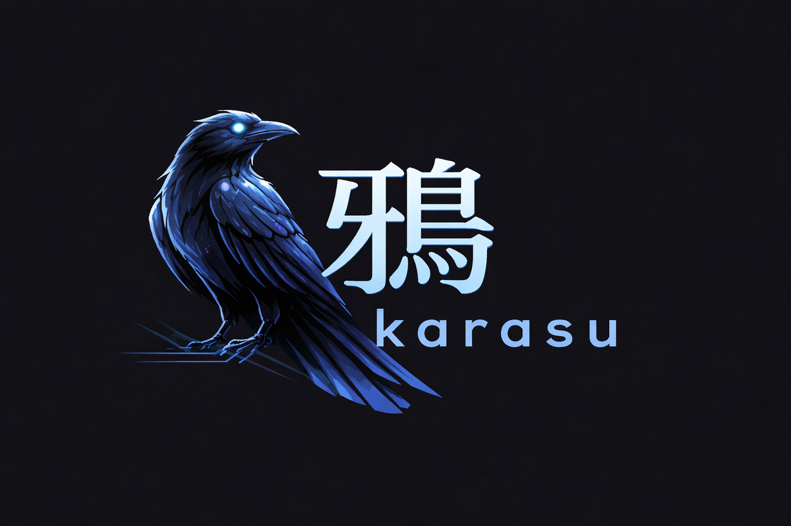

# karasu 鴉

<p align="center">
  
</p>

> **English** (this file) · [日本語](README.ja.md)

**A text-based DSL for describing the logical, physical, and organizational dimensions of a system in one language — built to co-design teams and architecture together.**

## What makes karasu different

- **Three-dimensional structure (logical / physical / organizational)** —
  Express the logical relationships between services and domains, the physical artifacts that get deployed, and the teams that own them in a single `.krs` language.
  Designed so that Conway's Law and the inverse Conway maneuver can be debated at the same table as the architecture itself.
- **Scoped glance + drill-down (progressive disclosure)** —
  Limit how much is shown at once; descend into any node when detail is needed.
  Rather than cramming an entire system into one "at a glance" bird's-eye diagram, karasu takes an intentional design choice to manage cognitive load.
- **A DSL humans and AI can co-author** —
  `.krs` was not designed for AI. It stands on its own as a tool humans read and write, and that independence is precisely what makes it bidirectional — AI can generate `.krs` a human can then hand-edit, and a hand-written model can be handed back to AI for refinement.

karasu takes inspiration from C4 Model, Structurizr, and Mermaid but stakes out a different position through its continuous drill-down, its third axis for organizational structure, and its affinity with AI co-authorship.
See [`docs/concepts.md`](docs/concepts.md) for the full design rationale.

## Project status

karasu is a **personal learning project** — not a commercial product. It is developed in the open partly as a vehicle for learning [Claude Code](https://claude.com/claude-code), and it is maintained on a **best-effort basis with no SLA**: issues and pull requests are welcome, but response times are not guaranteed.

That said, it is built to be safe to start adopting now:

- **`.krs` / `.krs.style` language spec — v1.0 (stable).** Backward compatibility is a commitment; a breaking change to the language would mean a v2.
- **`packages/core` TypeScript API — v0.x (no stability commitment).** The programmatic API may change between minor releases.
- **Maintainer response — best-effort, no SLA.**

## Try it

Run it in your browser: **<https://karasu.pages.dev/>**

A staged `ec-platform` tutorial (including Getting Started) loads automatically on first launch — a locale-matched seed (English or Japanese) is picked so the tutorial reads naturally in your language. You can edit `.krs`, preview, drill down, and export SVG right away. To use the AI chat feature, enter a Claude API key (BYOK) under the Settings tab — the key is stored in the browser's `sessionStorage` and is never sent to any external server.

## Why karasu

When development is spread across many repositories, nobody ends up owning the big picture. Architecture diagrams in Confluence or Notion stop getting updated, and new hires either get an oral walkthrough from whoever is available or get confused by stale material.

karasu addresses this by **concentrating the architecture description in a dedicated repository and letting teams split and compose files along their own boundaries**.

| Use case | Who uses it | What they need |
|----------|-------------|----------------|
| Discussing system design and evolution | Architects | Design the whole and compare alternatives |
| Making ownership explicit | Team leads | A formal record of who owns what |
| Onboarding | New hires | Understanding their team's domain and neighboring services |

## Design assumption

> **karasu is designed to be used in a dedicated architecture repository.**
>
> We deliberately do not support a model where `.krs` files are scattered across each service's implementation repository and stitched together over URLs. `import` supports **relative paths only**.
>
> Each team manages its own subdirectory within the architecture repository via CODEOWNERS and updates its `.krs` files there.

## Basic usage

```
system ECPlatform {
  label "EC Platform"

  user Customer [human]              { role "Buyer" }
  service ECommerce                  { label "EC Site" }
  service Payment [external]         { label "Payment Service" }
  service Inventory [external] @deprecated { label "Inventory (legacy)" }

  Customer  ->  ECommerce "Place an order"
  ECommerce ->  Payment   "Process payment"
  ECommerce --> Inventory "Sync inventory"
}
```

## Repository layout pattern

```
karasu-architecture/
  ├── index.krs                 ← Owned by an architect. Defines the whole structure
  ├── teams/
  │   ├── payment/
  │   │   └── service.krs       ← Owned and updated by the payment team
  │   ├── ec/
  │   │   └── service.krs       ← Owned and updated by the ec team
  │   └── inventory/
  │       └── service.krs
  └── deploy/
      └── production.krs
```

Setting CODEOWNERS on each team's directory distributes review responsibility while keeping the whole coherent.

```
# .github/CODEOWNERS
/teams/payment/   @payment-team
/teams/ec/        @ec-team
/index.krs        @architect
```

## Composing files with `import`

`import` supports relative paths only.

```
// index.krs — named import (pull in specific blocks)
import { Payment } from "./teams/payment/service.krs"
import { ECommerce } from "./teams/ec/service.krs"

// wildcard import (merge all blocks in the file)
import "./teams/inventory/service.krs"

system ECPlatform {
  ECommerce -> Payment "Process payment"
}
```

## Logical and physical structure

`realizes` makes explicit that "this deployment unit realizes this service".

```
// teams/ec/service.krs — logical structure (owned by the team)
service ECommerce {
  domain Order {
    usecase PlaceOrder  { label "Accept an order" }
    usecase CancelOrder { label "Cancel an order" }
  }
}

// deploy/production.krs — physical structure
deploy "production" {
  oci "api-server" {
    runtime  "Node.js 20"
    realizes ECommerce     // make the link to the logical service explicit
  }
  job "monthly-billing" {
    schedule "0 0 1 * *"
    realizes Billing
  }
}
```

## Organization and ownership

```
organization DevOrg {
  team Platform {
    label "Platform Team"
    owns ECommerce
    member Alice { slack "@alice" }
  }
}
```

## Diagram types

| Tab | Content |
|-----|---------|
| `System` | Logical diagram. Double-click to drill down system → service → domain → usecase |
| `Deploy` | Physical diagram. Deployment units and their correspondence to logical services via `realizes` |
| `Org` | Organization diagram. Team-to-service ownership. A Tree View mode gives the full overview |

## Chat UI and the AI assistant

The `Chat` tab enables interactive modeling against the Claude API. It uses **BYOK (Bring Your Own Key)** — the key lives entirely in your browser and is never sent to any server.

```
1. Enter your Claude API key under the Settings tab
2. Open the Chat tab — a structured interview scoped to the current ViewPath begins
3. Review the `.krs` patches the AI proposes and choose Apply / Reject before they take effect
```

- **Scope-aware**: when you drill down, the AI's question scope follows you
- **tool_use**: the AI returns intent as `navigate_view` / `apply_krs_patch` calls, not as free-form text
- **Conflict detection**: if you edit after a patch proposal, the Apply button is disabled automatically
- **Security**: keys default to `sessionStorage`; opt in to `localStorage` if you want them to persist

## Feature highlights

- **Logical / physical separation** — Business structure and deployment structure live in separate diagrams, linked by `realizes`
- **Drill-down** — Double-click to descend the hierarchy; breadcrumbs to go back up. "Show All Layers" flattens the hierarchy into one view; "Open All Views" opens every view in new windows
- **Graphical diff viewer** — Compare two `.krs` files (or the current file against a pasted blob or an OPFS history snapshot) and see the differences highlighted directly on the System / Deploy / Org diagrams — added / removed / modified nodes, edges, and annotations, with a one-click swap of the comparison direction
- **SVG / draw.io export** — Bulk export all diagrams as SVG (the exported SVG supports drill-down navigation in the browser on its own), or export to draw.io (mxGraph XML) as a layout escape hatch for pixel-perfect polishing
- **Top-level infra blocks** — `service`, `database`, `queue`, `storage` can be written at the file root without an enclosing `system`, so a deployment-centric file renders on its own
- **Deploy-only file auto-switch** — Opening a file whose only meaningful content is a `deploy` block automatically focuses the Deploy tab so you don't land on an empty System view
- **Icon mode** — Toggle System / Deploy / Org diagrams into icon display
- **Panel focus** — Collapse the sidebar and expand the preview to fill the screen
- **Domain drift detection** — Warns automatically when the same domain name is dispersed across multiple services
- **Deprecated-domain coexistence during migrations** — Render old and new domains side by side with `@deprecated` / `@migration_target`
- **Tags and annotations** — Tags such as `[external]` `[human]` `[async]` and client form-factors (`[web]` `[mobile]` `[desktop]` `[cli]` `[device]` `[extension]` `[embed]`); annotations `@deprecated` `@new` `@experimental` `@migration_target`. See `docs/spec/tags-annotations.md` for the full list (including synthesized tags like `[implicit]` `[cyclic]` `[read]` `[write]`)
- **Style separation** — A CSS-like `.krs.style` file controls appearance
- **Multi-file projects** — Compose files with relative-path `import` and `import "dir/"`, with cross-file navigation and jump support
- **Cross-system references** — Reference a service in another system with the dotted `PaymentGateway.PaymentService` notation
- **Domain-to-domain edges** — Declare `-> TargetDomain` inside a `domain` block; karasu derives the corresponding service-level edge automatically
- **ProjectMode ZIP import/export** — Write out or load back the browser-held project as a ZIP archive
- **Chat UI + BYOK AI assistant** — Bring your own Claude API key and grow `.krs` interactively via a structured interview
- **`.krs` formatter** — `karasu fmt` / LSP / the editor's Format button (Shift+Alt+F) reformats while preserving comments
- **VS Code extension** — Syntax highlighting, LSP diagnostics, SVG preview, bidirectional jump, icon-mode toggle
- **Internationalization (English / Japanese)** — UI strings, diagnostic and warning messages, chat tool descriptions, and the chat system prompt all follow a locale selector in Settings

## CLI

### Preview and rendering

```bash
# Start a local server and preview in the browser
karasu serve ./architecture

# Write SVG to stdout (redirect to a file)
karasu render index.krs > docs/arch.svg

# Render a specific view only
karasu render index.krs --view deploy --output deploy.svg

# Pipe through svgo for optimization
karasu render index.krs | svgo - -o docs/arch.svg

# Export to draw.io (mxGraph XML) as a layout escape hatch for pixel-perfect polishing
karasu render index.krs --format drawio --output arch.drawio
```

### Formatting

```bash
# Format in place
karasu fmt **/*.krs

# CI usage (exit 1 if there is a diff)
karasu fmt --check **/*.krs

# Accept input on a pipe and write to stdout
cat service.krs | karasu fmt --stdin
```

### Re-architecting an existing system

`karasu translate` is a command for **lifting the structure of an existing system into karasu's vocabulary so you can survey it from above**. The four supported input formats were each chosen to capture an existing system from a different angle:

| Input | What you get |
|-------|--------------|
| Docker Compose | Service execution topology and resource boundaries |
| Kubernetes manifests | Containerized runtime units and their inter-dependencies |
| OpenAPI schema | API boundaries and service responsibilities (RESTful operations are grouped into a single resource `usecase`) |
| SQL DDL | Data ownership and domain candidates (related tables are grouped under their aggregate root) |

Converting any of these into a `.krs` scaffold lets you model the current system in karasu's three-dimensional structure and then explore options for re-aligning domain boundaries or splitting services. Combined with `karasu apply` on a Unix pipe, you can also fold changes from the infrastructure side back into an existing `.krs`.

```bash
# Generate deploy.krs from docker-compose
karasu translate --from compose docker-compose.yml > deploy.krs

# Merge the translate output into an existing file (existing nodes are replaced, missing nodes appended)
karasu translate --from k8s manifests/deployment.yaml | karasu apply deploy.krs
```

### Structural editing of `.krs`

A set of commands for programmatically editing `.krs` files from the Chat UI or CI.

```bash
# Remove a node
karasu remove PaymentService arch.krs

# Append a top-level block
echo 'service NewService {}' | karasu append arch.krs

# Insert as a child of a given parent node (indent handled automatically)
echo 'service NewService {}' | karasu insert ECommerce arch.krs

# Apply a piped patch — replace nodes whose IDs already exist, append the rest
cat patch.krs | karasu apply arch.krs
```

### Diff and CRUD matrix

```bash
# Render a visual diff between two .krs versions
karasu diff before.krs after.krs --output diff.svg

# Pipe one side from stdin (e.g. compare HEAD against the working tree)
git show HEAD:arch.krs | karasu diff - arch.krs --output diff.svg

# Extract the usecase × resource CRUD matrix
karasu matrix arch.krs --format md > docs/crud.md
karasu matrix arch.krs --format svg --output docs/crud.svg
karasu matrix arch.krs --format csv --writes-only > writes.csv
```

## VS Code extension

> **Status: experimental**
>
> The VS Code extension is intentionally a lower priority than the core parser, renderer, and web preview. It is offered as a convenience for VS Code users who want to edit `.krs` locally; features such as completion, code actions, and rename are still minimal. If you want a polished basic authoring experience, the web preview (`karasu serve` or the hosted browser version) is recommended.

Located under `packages/vscode/`. What currently works:

- Syntax highlighting for `.krs` files
- LSP diagnostics (errors and warnings shown inline in the editor)
- SVG preview webview (with drill-down navigation)
- Bidirectional editor ↔ preview jump (Cmd/Ctrl+Click)
- Standard LSP features: hover, go-to-definition
- Node detail panel (with cross-diagram navigation)

## GitHub Actions

A workflow template is provided for automatically rendering `.krs` files into SVG in CI.

```yaml
- name: Render architecture diagrams
  run: npx --yes karasu@latest render docs/architecture.krs --output docs/architecture.svg
```

See [`examples/github-actions/`](examples/github-actions/) and [`docs/github-actions.md`](docs/github-actions.md) for details.

## Naming

The name comes from Huginn and Muninn — the ravens of Odin in Norse mythology, whose names mean *thought* and *memory*. The image of a raven that surveys the world from above and descends where it needs to gather information matches karasu's drill-down model of understanding architecture.

## Documentation

| Topic | Location |
|-------|----------|
| `.krs` syntax reference | `docs/spec/syntax.md` |
| `.krs.style` syntax reference | `docs/spec/style.md` |
| Tags and annotations catalog | `docs/spec/tags-annotations.md` |
| Core concepts (logical/physical/organizational separation, etc.) | `docs/concepts.md` |
| Decision history (ADR) | `docs/adr/` — `ADR-YYYYMMDD-NN-*.md` in date order |
| Design documents (in progress) | `docs/design/` |
| Acceptance test criteria | `docs/acceptance/` |
| Development process (lifecycle / PR flow) | `docs/process.md` |
| GitHub Actions integration guide | `docs/github-actions.md` |
| Sample `.krs` files | `examples/` |

## Repository layout

```
karasu/
├── docs/                  ← Specs and design docs
├── examples/              ← Sample .krs files (tutorials and themed scenarios)
├── packages/
│   ├── core/              ← Parser, style resolution, SVG renderer (pure TS)
│   ├── app/               ← Vite + React preview UI
│   ├── cli/               ← karasu serve / render commands
│   ├── lsp/               ← Language Server Protocol implementation
│   └── vscode/            ← VS Code extension
├── package.json           ← npm workspaces configuration
└── tsconfig.json
```

## Technology stack

| Area | Technology |
|------|------------|
| Language | TypeScript |
| App build | Vite |
| UI framework | React |
| Editor component | Monaco Editor |
| Testing | Vitest |
| CLI | commander |
| Language server | LSP (vscode-languageserver) |

## Inspiration

Inspired by C4 Model, but with its own vocabulary and an explicit separation between logical and physical structure.

## Contributing

See [`CONTRIBUTING.md`](CONTRIBUTING.md) for how to file issues, the maintainer's "best-effort, no SLA" stance, local setup, and the PR flow. Participation is governed by the [Contributor Covenant 2.1](CODE_OF_CONDUCT.md).

## License

Licensed under the [Apache License, Version 2.0](./LICENSE).
