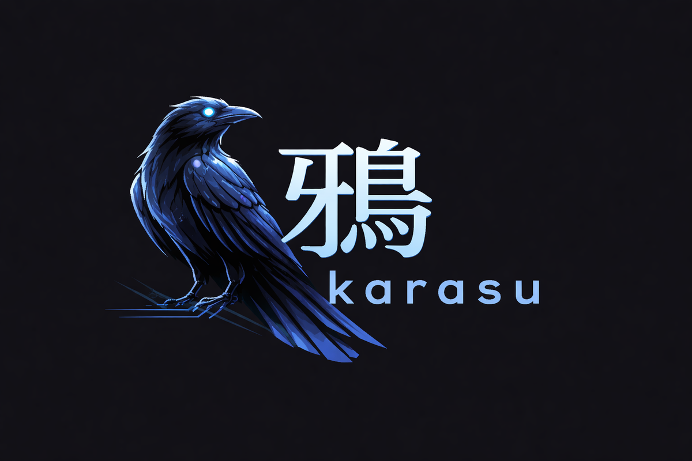

# karasu 鴉

<p align="center">
  
</p>

> **English** (this file) · [日本語](README.ja.md)

[](https://deepwiki.com/kompiro/karasu)
<a href="https://cloudflare.com"></a>

**Architecture as code for understanding and evolving real systems.**

karasu is a text-based architecture modeling language and toolchain. It keeps a
system's **logical structure**, **physical deployment**, and **team ownership**
in one model that people, code, and AI agents can all read and evolve.

[**Try it in your browser →**](https://karasu.kompiro.dev/)

[Documentation](https://kompiro.github.io/karasu/) ·
[Guides](https://kompiro.github.io/karasu/guide/) ·
[Syntax reference](https://kompiro.github.io/karasu/spec/syntax/) ·
[Examples](https://kompiro.github.io/karasu/examples/) ·
[VS Code](https://marketplace.visualstudio.com/items?itemName=karasu-tools.karasu-vscode)

## One model, three perspectives

Architecture is more than a diagram. You need to understand what the system
does, how it runs, who owns it, and how those boundaries change together.

| Perspective | What it describes |
| --- | --- |
| **Logical** | Systems, services, domains, use cases, entities, and dependencies |
| **Physical** | Deployments, runtimes, databases, queues, and storage |
| **Organizational** | Teams and ownership |

The `.krs` text is the source of truth. Humans can edit it, the CLI can derive it
from existing artifacts, and AI agents can create or refine it from source code.
karasu renders the same model as focused diagrams with continuous drill-down,
instead of forcing every level of a system into one overloaded picture.

## Try it

### 1. Explore in the browser

Open the [web app](https://karasu.kompiro.dev/) to edit a model, navigate its
diagrams, and follow the built-in tutorial. Nothing needs to be installed.

### 2. Bootstrap from your own system

Already have Docker Compose, Kubernetes manifests, an OpenAPI schema, or SQL
DDL? `karasu translate` turns it into an editable `.krs` starting point:

```bash
npx --yes karasu@latest translate --from compose docker-compose.yml > architecture.krs
npx --yes karasu@latest serve .
```

Use `--from k8s`, `--from openapi`, or `--from db` for the other supported
inputs. See [Using the CLI](https://kompiro.github.io/karasu/tools/cli/) for the
full command reference.

### 3. Reverse-engineer a repository with an AI agent

Use the [`reverse-architecture` skill](.claude/skills/reverse-architecture/SKILL.md)
to have a repository-aware AI agent inspect an existing codebase and build a
karasu model. The workflow combines agent judgment for domain structure with
deterministic CLI extraction and validation.

The result is a map to review and evolve, not a claim of perfect ground truth.
karasu remains useful without AI: the model is plain text, editable by hand,
and independent of the agent that produced it.

## A small model

```krs
system Shop {
  user Customer [human]
  service Storefront {
    domain Ordering
  }
  service Payment [external]

  Customer -> Storefront "Place an order"
  Storefront -> Payment "Charge"
}

deploy Production {
  oci WebApp {
    runtime "Node.js"
    realizes Storefront
  }
}

organization Product {
  team Commerce {
    owns Storefront
  }
}
```

Open it in the web app or run `npx --yes karasu@latest serve .` to move between
the System, Deploy, and Org views and drill into the details.

## Why karasu?

- **Architecture that can evolve with the system** — review text changes in Git,
  compare diagrams, and keep architecture close to engineering work.
- **Logical, physical, and organizational boundaries together** — discuss
  service design, deployment, and ownership in the same vocabulary.
- **Progressive disclosure** — start with a scoped overview, then drill down
  only where detail is useful.
- **A shared model for people and tools** — hand-edit `.krs`, generate a scaffold
  from structured inputs, or let an AI agent propose changes without making the
  model dependent on AI.

karasu takes inspiration from C4 Model, Structurizr, and Mermaid. Read
[Core concepts](https://kompiro.github.io/karasu/concepts/) for the design
rationale and [the guides](https://kompiro.github.io/karasu/guide/) for modeling
service and team boundaries, onboarding, and architectural evolution.

## Documentation

- [Using the web app](https://kompiro.github.io/karasu/tools/app/)
- [Using the CLI](https://kompiro.github.io/karasu/tools/cli/)
- [Guides](https://kompiro.github.io/karasu/guide/)
- [Syntax reference](https://kompiro.github.io/karasu/spec/syntax/)
- [Style reference](https://kompiro.github.io/karasu/spec/style/)
- [Examples](https://kompiro.github.io/karasu/examples/)

## Project status

karasu is a personal learning project, maintained on a best-effort basis with no
SLA. The `.krs` / `.krs.style` language specification is v1.0 and keeps backward
compatibility; the TypeScript API remains v0.x and may change between minor
releases. See [ADR-1314](docs/adr/1314-krs-spec-v1-freeze.md) for the language
compatibility commitment.

## Contributing, security, and license

Issues and pull requests are welcome. See [CONTRIBUTING.md](CONTRIBUTING.md) and
the [Code of Conduct](CODE_OF_CONDUCT.md). Report vulnerabilities through
[private vulnerability reporting](https://github.com/kompiro/karasu/security/advisories/new),
not a public issue; see [SECURITY.md](SECURITY.md).

Licensed under the [Apache License, Version 2.0](LICENSE).
