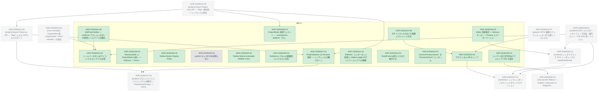

# ADR Topic: app-ui

16 ADRs in this topic. Solid nodes belong to `app-ui`; gray dashed nodes are ghosts showing cross-topic references to help navigation.

Other topics: [overview](../graph.md).

```mermaid
flowchart TD
  subgraph app-ui["app-ui"]
    ADR_20260323_02["ADR-20260323-02<br/>ツールバーボタンはアイコン+テキストラベル必須"]
    ADR_20260326_02["ADR-20260326-02<br/>MemoryMode と ProjectMode の統一 — Reducer + `Karas..."]
    ADR_20260326_03["ADR-20260326-03<br/>Editor 診断表示 — Monaco マーカー + Preview エラーオーバーレイ"]
    ADR_20260330_02["ADR-20260330-02<br/>Toolbar Button Display Rules"]
    ADR_20260404_04["ADR-20260404-04<br/>system セレクタUIを採用しない"]
    ADR_20260405_02["ADR-20260405-02<br/>Toolbar Button Actionable Modifier Class"]
    ADR_20260405_04["ADR-20260405-04<br/>Reference パネルの図種別コンテキスト対応"]
    ADR_20260407_03["ADR-20260407-03<br/>ProjectSelector の Rename 操作 — インライン入力欄パターン"]
    ADR_20260408_03["ADR-20260408-03<br/>ProjectMode 初期コンテンツ — `examples/ec-platform` から..."]
    ADR_20260411_04["ADR-20260411-04<br/>`EditArea` コンポーネント新設と sidebar-toggle のサイドバーエリアへの移動"]
    ADR_20260411_08["ADR-20260411-08<br/>EditPaneToolbar — LeftPane アクションボタンの専用ツールバーへの集約"]
    ADR_20260413_03["ADR-20260413-03<br/>DetailPanel は常に1つだけ表示する"]
    ADR_20260419_02["ADR-20260419-02<br/>`KarasuPreviewColumn` を `PreviewColumn` にリネーム"]
    ADR_20260420_02["ADR-20260420-02<br/>グラフィカル diff ビューア"]
    ADR_20260422_06["ADR-20260422-06<br/>Diff ペースト入力の UI 配置とストレージ方式"]
    ADR_20260425_01["ADR-20260425-01<br/>ユーザー向け文字列はデフォルトで i18n を通す"]
  end
  ADR_20260317_01["ADR-20260317-01<br/>[renderer] 2 レイヤレンダリングとドリルダウンナビゲーション"]
  ADR_20260317_02["ADR-20260317-02<br/>[project] プロジェクトとファイルシステム抽象化 — `FileSystemProvider` + OPFS"]
  ADR_20260320_01["ADR-20260320-01<br/>[renderer] インタラクティブ SVG レンダリングと NodeDetailPanel"]
  ADR_20260323_03["ADR-20260323-03<br/>[core-concepts] Organization 図（organization / team / member）の追加"]
  ADR_20260328_02["ADR-20260328-02<br/>[renderer] SVG エクスポートの 2 フェーズ実装（現在ビュー + Full View 単一ファイル）"]
  ADR_20260411_06["ADR-20260411-06<br/>[project] Export Project as ZIP — `fflate` による OPFS エクスポート"]
  ADR_20260412_03["ADR-20260412-03<br/>[project] Import Project from ZIP — `fflate` 再利用 + トップレベル除去"]
  ADR_20260420_03["ADR-20260420-03<br/>[chat-ai] i18n Rollout — English / Japanese UI, Diagnosti..."]
  ADR_20260422_07["ADR-20260422-07<br/>[project] OPFS 履歴スナップショットを diff 比較ソースにする"]
  ADR_20260326_03 --> ADR_20260320_01
  ADR_20260407_03 --> ADR_20260317_02
  ADR_20260411_08 --> ADR_20260323_02
  ADR_20260420_02 --> ADR_20260317_01
  ADR_20260422_06 --> ADR_20260420_02
  ADR_20260425_01 --> ADR_20260420_03
  ADR_20260320_01 --> ADR_20260317_01
  ADR_20260323_03 --> ADR_20260323_02
  ADR_20260328_02 --> ADR_20260317_01
  ADR_20260328_02 --> ADR_20260320_01
  ADR_20260328_02 --> ADR_20260323_02
  ADR_20260411_06 --> ADR_20260317_02
  ADR_20260411_06 --> ADR_20260407_03
  ADR_20260412_03 --> ADR_20260407_03
  ADR_20260412_03 --> ADR_20260408_03
  ADR_20260412_03 --> ADR_20260411_06
  ADR_20260422_07 --> ADR_20260420_02

  classDef accepted fill:#d4edda,stroke:#28a745,color:#155724
  classDef proposed fill:#fff3cd,stroke:#ffc107,color:#856404
  classDef deprecated fill:#f8d7da,stroke:#dc3545,color:#721c24
  classDef superseded fill:#e2e3e5,stroke:#6c757d,color:#383d41
  classDef not_adopted fill:#e2e3e5,stroke:#6c757d,color:#383d41,stroke-dasharray:3 3
  classDef ghost fill:#f5f5f5,stroke:#adb5bd,color:#6c757d,stroke-dasharray:2 2
  class ADR_20260323_02 accepted
  class ADR_20260326_02 accepted
  class ADR_20260326_03 accepted
  class ADR_20260330_02 accepted
  class ADR_20260404_04 not_adopted
  class ADR_20260405_02 accepted
  class ADR_20260405_04 accepted
  class ADR_20260407_03 accepted
  class ADR_20260408_03 accepted
  class ADR_20260411_04 accepted
  class ADR_20260411_08 accepted
  class ADR_20260413_03 accepted
  class ADR_20260419_02 accepted
  class ADR_20260420_02 accepted
  class ADR_20260422_06 accepted
  class ADR_20260425_01 accepted
  class ADR_20260317_01 ghost
  class ADR_20260317_02 ghost
  class ADR_20260320_01 ghost
  class ADR_20260323_03 ghost
  class ADR_20260328_02 ghost
  class ADR_20260411_06 ghost
  class ADR_20260412_03 ghost
  class ADR_20260420_03 ghost
  class ADR_20260422_07 ghost
```
