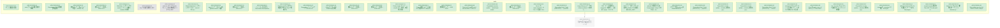

# ADR Topic: build

43 ADRs in this topic. Solid nodes belong to `build`; gray dashed nodes are ghosts showing cross-topic references to help navigation.

Other topics: [overview](../graph.md).

```mermaid
flowchart TD
  subgraph build["build"]
    ADR_20260312_01["ADR-20260312-01<br/>モノレポ構成の採用"]
    ADR_20260326_01["ADR-20260326-01<br/>main ブランチの健全性維持戦略"]
    ADR_20260329_01["ADR-20260329-01<br/>Dependabot による依存更新の自動化"]
    ADR_20260330_01["ADR-20260330-01<br/>依存パッケージのメジャー更新 — 2026 年 3 月"]
    ADR_20260331_01["ADR-20260331-01<br/>依存パッケージ更新 — 2026-03-31"]
    ADR_20260401_01["ADR-20260401-01<br/>Markdown レンダリングに marked、ファイル監視に chokidar を採用"]
    ADR_20260404_01["ADR-20260404-01<br/>Bun への移行は採用しない"]
    ADR_20260404_02["ADR-20260404-02<br/>start-dev スキルで Claude セッション名を機能名にリネームしない"]
    ADR_20260404_06["ADR-20260404-06<br/>GitHub Markdown レンダリングサービス — `serve.ts` の `/ren..."]
    ADR_20260405_01["ADR-20260405-01<br/>npm パッケージスコープを @karasu-tools/* に変更"]
    ADR_20260407_01["ADR-20260407-01<br/>依存パッケージ更新 — 2026-04-07"]
    ADR_20260408_01["ADR-20260408-01<br/>リリーストグルを伴う Trunk-Based Development"]
    ADR_20260413_01["ADR-20260413-01<br/>Preview workflow はラベル駆動をやめ path filter で制御する"]
    ADR_20260414_01["ADR-20260414-01<br/>Dependabot バッチトリアージ（2026-04-14）"]
    ADR_20260416_01["ADR-20260416-01<br/>HTML サニタイズに DOMPurify を採用"]
    ADR_20260421_01["ADR-20260421-01<br/>依存パッケージ更新 — 2026-04-20"]
    ADR_20260422_01["ADR-20260422-01<br/>依存パッケージ更新 — 2026-04-21"]
    ADR_20260427_01["ADR-20260427-01<br/>Feature toggle ポリシー — compile-time、短命、卒業時に削除"]
    ADR_20260428_01["ADR-20260428-01<br/>Secret 必須の CI ジョブは bot 作者の PR で skip する"]
    ADR_20260428_02["ADR-20260428-02<br/>依存更新バッチ — 2026-04-28"]
    ADR_20260428_08["ADR-20260428-08<br/>Required Check は paired stub workflow で docs-on..."]
    ADR_20260429_08["ADR-20260429-08<br/>Dependabot security update — `@anthropic-ai/sdk..."]
    ADR_20260505_01["ADR-20260505-01<br/>依存パッケージ更新 — 2026-05-05"]
    ADR_20260512_01["ADR-20260512-01<br/>`fast-uri` を `pnpm.overrides` で `^3.1.2` に固定（GH..."]
    ADR_20260512_02["ADR-20260512-02<br/>Dependabot Batch Triage (2026-05-12) — `pnpm/ac..."]
    ADR_20260512_03["ADR-20260512-03<br/>in-app Reference データを `reference-data.ts` に集約し、..."]
    ADR_20260512_05["ADR-20260512-05<br/>OSS リリース自動化に changesets を採用し、当面は `karasu`（CLI）の..."]
    ADR_20260513_02["ADR-20260513-02<br/>OSS リリースのライセンス順守を allowlist CI と自動生成 THIRD_PART..."]
    ADR_20260513_04["ADR-20260513-04<br/>portable な開発スキルは `kompiro/hane` plugin に切り出し、ka..."]
    ADR_20260513_05["ADR-20260513-05<br/>ユーザー作成 worktree は `.claude/worktrees/<branch>` ..."]
    ADR_20260519_05["ADR-20260519-05<br/>Dependabot Batch Triage (2026-05-19) — `pnpm/ac..."]
    ADR_20260520_05["ADR-20260520-05<br/>Dependabot security update — transitive 依存を pnp..."]
    ADR_20260615_03["ADR-20260615-03<br/>Dependabot security update — transitive 依存を pnp..."]
    ADR_20260615_06["ADR-20260615-06<br/>Dependabot Batch Triage (2026-06-15) — `actions..."]
    ADR_20260616_02["ADR-20260616-02<br/>docs/guide の hero スニペットを正典として、レンダリング済み SVG を生成・..."]
    ADR_20260616_03["ADR-20260616-03<br/>docs/ を single source of truth として Astro Starli..."]
    ADR_20260616_06["ADR-20260616-06<br/>.krs / .krs.style を v1.0 として凍結する（ハイブリッド版管理）"]
    ADR_20260616_07["ADR-20260616-07<br/>Dependabot security update — transitive 依存を pnp..."]
    ADR_20260616_08["ADR-20260616-08<br/>example を examples/<lang>/<name>/ に揃え、docs gall..."]
    ADR_20260616_10["ADR-20260616-10<br/>@karasu-tools/core を v0.x の公開パッケージにする（developme..."]
    ADR_20260618_02["ADR-20260618-02<br/>js-yaml transitive 脆弱性（alert #24）を read-yaml-fi..."]
    ADR_20260618_03["ADR-20260618-03<br/>karasu CLI の publish 成果物を単一バンドル `dist/index.js`..."]
    ADR_20260619_01["ADR-20260619-01<br/>Dependabot security alert（undici #37/#38, dompu..."]
  end
  ADR_20260322_01["ADR-20260322-01<br/>[styling] ビルトインスタイルの一元化と構造化リファレンス"]
  ADR_20260512_03 --> ADR_20260322_01

  classDef accepted fill:#d4edda,stroke:#28a745,color:#155724
  classDef proposed fill:#fff3cd,stroke:#ffc107,color:#856404
  classDef deprecated fill:#f8d7da,stroke:#dc3545,color:#721c24
  classDef superseded fill:#e2e3e5,stroke:#6c757d,color:#383d41
  classDef not_adopted fill:#e2e3e5,stroke:#6c757d,color:#383d41,stroke-dasharray:3 3
  classDef ghost fill:#f5f5f5,stroke:#adb5bd,color:#6c757d,stroke-dasharray:2 2
  class ADR_20260312_01 accepted
  class ADR_20260326_01 accepted
  class ADR_20260329_01 accepted
  class ADR_20260330_01 accepted
  class ADR_20260331_01 accepted
  class ADR_20260401_01 accepted
  class ADR_20260404_01 not_adopted
  class ADR_20260404_02 not_adopted
  class ADR_20260404_06 accepted
  class ADR_20260405_01 accepted
  class ADR_20260407_01 accepted
  class ADR_20260408_01 accepted
  class ADR_20260413_01 accepted
  class ADR_20260414_01 accepted
  class ADR_20260416_01 accepted
  class ADR_20260421_01 accepted
  class ADR_20260422_01 accepted
  class ADR_20260427_01 accepted
  class ADR_20260428_01 accepted
  class ADR_20260428_02 accepted
  class ADR_20260428_08 accepted
  class ADR_20260429_08 accepted
  class ADR_20260505_01 accepted
  class ADR_20260512_01 accepted
  class ADR_20260512_02 accepted
  class ADR_20260512_03 accepted
  class ADR_20260512_05 accepted
  class ADR_20260513_02 accepted
  class ADR_20260513_04 accepted
  class ADR_20260513_05 accepted
  class ADR_20260519_05 accepted
  class ADR_20260520_05 accepted
  class ADR_20260615_03 accepted
  class ADR_20260615_06 accepted
  class ADR_20260616_02 accepted
  class ADR_20260616_03 accepted
  class ADR_20260616_06 accepted
  class ADR_20260616_07 accepted
  class ADR_20260616_08 accepted
  class ADR_20260616_10 accepted
  class ADR_20260618_02 accepted
  class ADR_20260618_03 accepted
  class ADR_20260619_01 accepted
  class ADR_20260322_01 ghost
```
