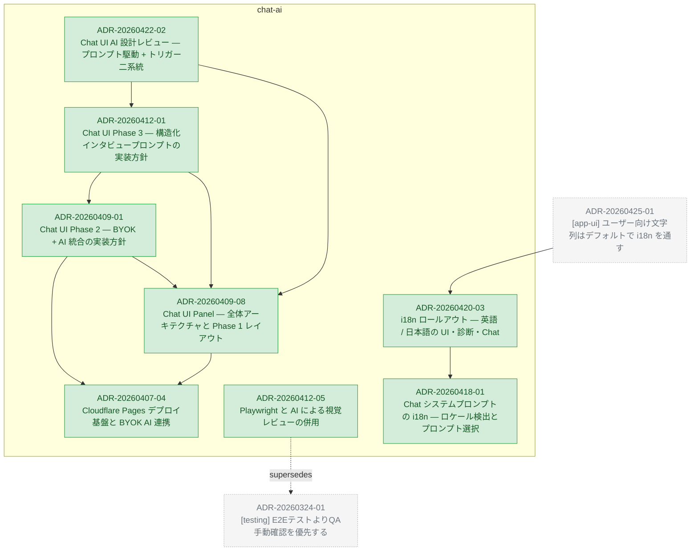

# ADR Topic: chat-ai

8 ADRs in this topic. Solid nodes belong to `chat-ai`; gray dashed nodes are ghosts showing cross-topic references to help navigation.

Other topics: [overview](../graph.md).

