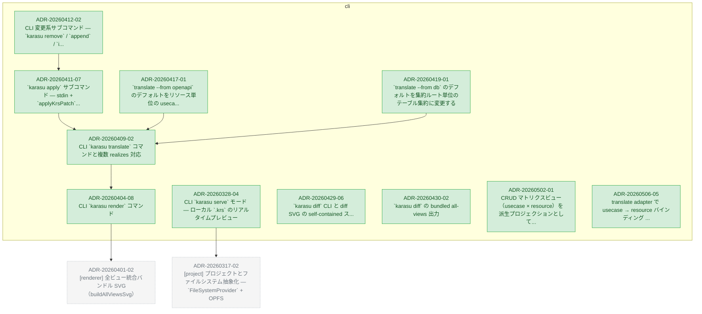

# ADR Topic: cli

11 ADRs in this topic. Solid nodes belong to `cli`; gray dashed nodes are ghosts showing cross-topic references to help navigation.

Other topics: [overview](../graph.md).

```mermaid
flowchart TD
  subgraph cli["cli"]
    ADR_20260328_04["ADR-20260328-04<br/>CLI `karasu serve` モード — ローカル `.krs` のリアルタイムプレビュー"]
    ADR_20260404_08["ADR-20260404-08<br/>CLI `karasu render` コマンド"]
    ADR_20260409_02["ADR-20260409-02<br/>CLI `karasu translate` コマンドと複数 realizes 対応"]
    ADR_20260411_07["ADR-20260411-07<br/>`karasu apply` サブコマンド — stdin + `applyKrsPatch`..."]
    ADR_20260412_02["ADR-20260412-02<br/>CLI 変更系サブコマンド — `karasu remove` / `append` / `i..."]
    ADR_20260417_01["ADR-20260417-01<br/>`translate --from openapi` のデフォルトをリソース単位の useca..."]
    ADR_20260419_01["ADR-20260419-01<br/>`translate --from db` のデフォルトを集約ルート単位のテーブル集約に変更する"]
    ADR_20260429_06["ADR-20260429-06<br/>`karasu diff` CLI と diff SVG の self-contained ス..."]
    ADR_20260430_02["ADR-20260430-02<br/>`karasu diff` の bundled all-views 出力"]
    ADR_20260502_01["ADR-20260502-01<br/>CRUD マトリクスビュー（usecase × resource）を派生プロジェクションとして..."]
    ADR_20260506_05["ADR-20260506-05<br/>translate adapter で usecase → resource バインディング ..."]
  end
  ADR_20260317_02["ADR-20260317-02<br/>[project] プロジェクトとファイルシステム抽象化 — `FileSystemProvider` + OPFS"]
  ADR_20260401_02["ADR-20260401-02<br/>[renderer] 全ビュー統合バンドル SVG（buildAllViewsSvg）"]
  ADR_20260328_04 --> ADR_20260317_02
  ADR_20260404_08 --> ADR_20260401_02
  ADR_20260409_02 --> ADR_20260404_08
  ADR_20260411_07 --> ADR_20260409_02
  ADR_20260412_02 --> ADR_20260411_07
  ADR_20260417_01 --> ADR_20260409_02
  ADR_20260419_01 --> ADR_20260409_02

  classDef accepted fill:#d4edda,stroke:#28a745,color:#155724
  classDef proposed fill:#fff3cd,stroke:#ffc107,color:#856404
  classDef deprecated fill:#f8d7da,stroke:#dc3545,color:#721c24
  classDef superseded fill:#e2e3e5,stroke:#6c757d,color:#383d41
  classDef not_adopted fill:#e2e3e5,stroke:#6c757d,color:#383d41,stroke-dasharray:3 3
  classDef ghost fill:#f5f5f5,stroke:#adb5bd,color:#6c757d,stroke-dasharray:2 2
  class ADR_20260328_04 accepted
  class ADR_20260404_08 accepted
  class ADR_20260409_02 accepted
  class ADR_20260411_07 accepted
  class ADR_20260412_02 accepted
  class ADR_20260417_01 accepted
  class ADR_20260419_01 accepted
  class ADR_20260429_06 accepted
  class ADR_20260430_02 accepted
  class ADR_20260502_01 accepted
  class ADR_20260506_05 accepted
  class ADR_20260317_02 ghost
  class ADR_20260401_02 ghost
```
