# ADR Topic: core-concepts

9 ADRs in this topic. Solid nodes belong to `core-concepts`; gray dashed nodes are ghosts showing cross-topic references to help navigation.

Other topics: [overview](../graph.md).

```mermaid
flowchart TD
  subgraph core-concepts["core-concepts"]
    ADR_20260312_02["ADR-20260312-02<br/>ツール名「karasu」の採用"]
    ADR_20260312_03["ADR-20260312-03<br/>論理構造と物理構造の分離"]
    ADR_20260323_03["ADR-20260323-03<br/>Organization 図（organization / team / member）の追加"]
    ADR_20260404_10["ADR-20260404-10<br/>Org Tree View — 組織階層の左→右ツリー俯瞰図"]
    ADR_20260428_06["ADR-20260428-06<br/>クライアント / MCP を system 図でどう表現するか — `client` kind..."]
    ADR_20260429_07["ADR-20260429-07<br/>client の capability 軸 — device / browser permis..."]
    ADR_20260430_01["ADR-20260430-01<br/>セキュリティ／脅威モデリングは karasu の語彙に取り込まず companion docu..."]
    ADR_20260511_02["ADR-20260511-02<br/>実行時認可（usecase レベルの authz）は karasu の語彙に取り込まない"]
    ADR_20260511_04["ADR-20260511-04<br/>user.role キーワードは存続させ、spec で「authz primitive ではな..."]
  end
  ADR_20260323_02["ADR-20260323-02<br/>[app-ui] ツールバーボタンはアイコン+テキストラベル必須"]
  ADR_20260401_06["ADR-20260401-06<br/>[resolver] Domain Drift Detection — 検出スコープと検出キー"]
  ADR_20260323_03 --> ADR_20260312_03
  ADR_20260323_03 --> ADR_20260323_02
  ADR_20260404_10 --> ADR_20260323_03
  ADR_20260401_06 --> ADR_20260312_03

  classDef accepted fill:#d4edda,stroke:#28a745,color:#155724
  classDef proposed fill:#fff3cd,stroke:#ffc107,color:#856404
  classDef deprecated fill:#f8d7da,stroke:#dc3545,color:#721c24
  classDef superseded fill:#e2e3e5,stroke:#6c757d,color:#383d41
  classDef not_adopted fill:#e2e3e5,stroke:#6c757d,color:#383d41,stroke-dasharray:3 3
  classDef ghost fill:#f5f5f5,stroke:#adb5bd,color:#6c757d,stroke-dasharray:2 2
  class ADR_20260312_02 accepted
  class ADR_20260312_03 accepted
  class ADR_20260323_03 accepted
  class ADR_20260404_10 accepted
  class ADR_20260428_06 accepted
  class ADR_20260429_07 accepted
  class ADR_20260430_01 accepted
  class ADR_20260511_02 accepted
  class ADR_20260511_04 accepted
  class ADR_20260323_02 ghost
  class ADR_20260401_06 ghost
```

