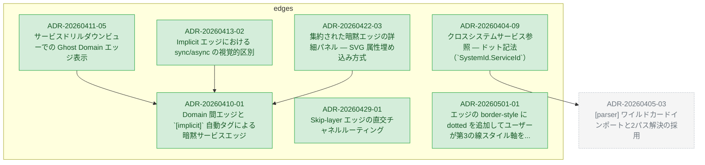

# ADR Topic: edges

7 ADRs in this topic. Solid nodes belong to `edges`; gray dashed nodes are ghosts showing cross-topic references to help navigation.

Other topics: [overview](../graph.md).

```mermaid
flowchart TD
  subgraph edges["edges"]
    ADR_20260404_09["ADR-20260404-09<br/>クロスシステムサービス参照 — ドット記法（`SystemId.ServiceId`）"]
    ADR_20260410_01["ADR-20260410-01<br/>Domain 間エッジと `[implicit]` 自動タグによる暗黙サービスエッジ"]
    ADR_20260411_05["ADR-20260411-05<br/>サービスドリルダウンビューでの Ghost Domain エッジ表示"]
    ADR_20260413_02["ADR-20260413-02<br/>Implicit エッジにおける sync/async の視覚的区別"]
    ADR_20260422_03["ADR-20260422-03<br/>集約された暗黙エッジの詳細パネル — SVG 属性埋め込み方式"]
    ADR_20260429_01["ADR-20260429-01<br/>Skip-layer エッジの直交チャネルルーティング"]
    ADR_20260501_01["ADR-20260501-01<br/>エッジの border-style に dotted を追加してユーザーが第3の線スタイル軸を..."]
  end
  ADR_20260405_03["ADR-20260405-03<br/>[parser] ワイルドカードインポートと2パス解決の採用"]
  ADR_20260404_09 --> ADR_20260405_03
  ADR_20260411_05 --> ADR_20260410_01
  ADR_20260413_02 --> ADR_20260410_01
  ADR_20260422_03 --> ADR_20260410_01

  classDef accepted fill:#d4edda,stroke:#28a745,color:#155724
  classDef proposed fill:#fff3cd,stroke:#ffc107,color:#856404
  classDef deprecated fill:#f8d7da,stroke:#dc3545,color:#721c24
  classDef superseded fill:#e2e3e5,stroke:#6c757d,color:#383d41
  classDef not_adopted fill:#e2e3e5,stroke:#6c757d,color:#383d41,stroke-dasharray:3 3
  classDef ghost fill:#f5f5f5,stroke:#adb5bd,color:#6c757d,stroke-dasharray:2 2
  class ADR_20260404_09 accepted
  class ADR_20260410_01 accepted
  class ADR_20260411_05 accepted
  class ADR_20260413_02 accepted
  class ADR_20260422_03 accepted
  class ADR_20260429_01 accepted
  class ADR_20260501_01 accepted
  class ADR_20260405_03 ghost
```
