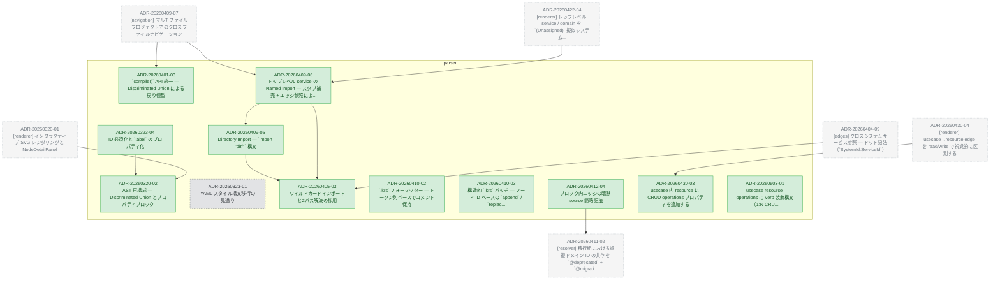

# ADR Topic: parser

12 ADRs in this topic. Solid nodes belong to `parser`; gray dashed nodes are ghosts showing cross-topic references to help navigation.

Other topics: [overview](../graph.md).

```mermaid
flowchart TD
  subgraph parser["parser"]
    ADR_20260320_02["ADR-20260320-02<br/>AST 再構成 — Discriminated Union とプロパティブロック"]
    ADR_20260323_01["ADR-20260323-01<br/>YAML スタイル構文移行の見送り"]
    ADR_20260323_04["ADR-20260323-04<br/>ID 必須化と `label` のプロパティ化"]
    ADR_20260401_03["ADR-20260401-03<br/>`compile()` API 統一 — Discriminated Union による戻り値型"]
    ADR_20260405_03["ADR-20260405-03<br/>ワイルドカードインポートと2パス解決の採用"]
    ADR_20260409_05["ADR-20260409-05<br/>Directory Import — `import &quot;dir/&quot;` 構文"]
    ADR_20260409_06["ADR-20260409-06<br/>トップレベル service の Named Import — スタブ補完 + エッジ参照によ..."]
    ADR_20260410_02["ADR-20260410-02<br/>`.krs` フォーマッター — トークン列ベースでコメント保持"]
    ADR_20260410_03["ADR-20260410-03<br/>構造的 `.krs` パッチ — ノード ID ベースの `append` / `replac..."]
    ADR_20260412_04["ADR-20260412-04<br/>ブロック内エッジの暗黙 source 簡略記法"]
    ADR_20260430_03["ADR-20260430-03<br/>usecase 内 resource に CRUD operations プロパティを追加する"]
    ADR_20260503_01["ADR-20260503-01<br/>usecase resource operations に verb 装飾構文（1:N CRU..."]
  end
  ADR_20260320_01["ADR-20260320-01<br/>[renderer] インタラクティブ SVG レンダリングと NodeDetailPanel"]
  ADR_20260404_09["ADR-20260404-09<br/>[edges] クロスシステムサービス参照 — ドット記法（`SystemId.ServiceId`）"]
  ADR_20260409_07["ADR-20260409-07<br/>[navigation] マルチファイルプロジェクトでのクロスファイルナビゲーション"]
  ADR_20260411_02["ADR-20260411-02<br/>[resolver] 移行期における重複ドメイン ID の共存を `@deprecated` + `@migrati..."]
  ADR_20260422_04["ADR-20260422-04<br/>[renderer] トップレベル service / domain を `(Unassigned)` 擬似システム..."]
  ADR_20260430_04["ADR-20260430-04<br/>[renderer] usecase→resource edge を read/write で視覚的に区別する"]
  ADR_20260323_04 --> ADR_20260320_02
  ADR_20260409_05 --> ADR_20260405_03
  ADR_20260409_06 --> ADR_20260409_05
  ADR_20260409_06 --> ADR_20260405_03
  ADR_20260412_04 --> ADR_20260411_02
  ADR_20260320_01 --> ADR_20260320_02
  ADR_20260404_09 --> ADR_20260405_03
  ADR_20260409_07 --> ADR_20260409_06
  ADR_20260409_07 --> ADR_20260401_03
  ADR_20260422_04 --> ADR_20260409_06
  ADR_20260430_04 --> ADR_20260430_03

  classDef accepted fill:#d4edda,stroke:#28a745,color:#155724
  classDef proposed fill:#fff3cd,stroke:#ffc107,color:#856404
  classDef deprecated fill:#f8d7da,stroke:#dc3545,color:#721c24
  classDef superseded fill:#e2e3e5,stroke:#6c757d,color:#383d41
  classDef not_adopted fill:#e2e3e5,stroke:#6c757d,color:#383d41,stroke-dasharray:3 3
  classDef ghost fill:#f5f5f5,stroke:#adb5bd,color:#6c757d,stroke-dasharray:2 2
  class ADR_20260320_02 accepted
  class ADR_20260323_01 not_adopted
  class ADR_20260323_04 accepted
  class ADR_20260401_03 accepted
  class ADR_20260405_03 accepted
  class ADR_20260409_05 accepted
  class ADR_20260409_06 accepted
  class ADR_20260410_02 accepted
  class ADR_20260410_03 accepted
  class ADR_20260412_04 accepted
  class ADR_20260430_03 accepted
  class ADR_20260503_01 accepted
  class ADR_20260320_01 ghost
  class ADR_20260404_09 ghost
  class ADR_20260409_07 ghost
  class ADR_20260411_02 ghost
  class ADR_20260422_04 ghost
  class ADR_20260430_04 ghost
```
