# ADR Topic: renderer

24 ADRs in this topic. Solid nodes belong to `renderer`; gray dashed nodes are ghosts showing cross-topic references to help navigation.

Other topics: [overview](../graph.md).

```mermaid
flowchart TD
  subgraph renderer["renderer"]
    ADR_20260316_01["ADR-20260316-01<br/>SVGアイコンファイルの外部インポート方式"]
    ADR_20260317_01["ADR-20260317-01<br/>2 レイヤレンダリングとドリルダウンナビゲーション"]
    ADR_20260320_01["ADR-20260320-01<br/>インタラクティブ SVG レンダリングと NodeDetailPanel"]
    ADR_20260327_01["ADR-20260327-01<br/>Deployment 図の設計判断"]
    ADR_20260328_02["ADR-20260328-02<br/>SVG エクスポートの 2 フェーズ実装（現在ビュー + Full View 単一ファイル）"]
    ADR_20260328_03["ADR-20260328-03<br/>アイコンモード — SVG アイコンによるノード表示切り替え"]
    ADR_20260329_02["ADR-20260329-02<br/>KarasuPreviewColumn からの SVG エクスポート責務分離"]
    ADR_20260401_02["ADR-20260401-02<br/>全ビュー統合バンドル SVG（buildAllViewsSvg）"]
    ADR_20260404_03["ADR-20260404-03<br/>PNG エクスポートは実装しない"]
    ADR_20260405_07["ADR-20260405-07<br/>クロスシステム参照の Ghost System レンダリング"]
    ADR_20260407_02["ADR-20260407-02<br/>resource shape 自動推論とインフラノード Icon Mode 対応"]
    ADR_20260408_02["ADR-20260408-02<br/>Deploy 図レイアウト — 階層 DAG レイアウト（Longest Path Layer..."]
    ADR_20260409_04["ADR-20260409-04<br/>同レイヤー内コンテナ順序の Barycenter ヒューリスティックによる最適化"]
    ADR_20260411_01["ADR-20260411-01<br/>Architecture レイアウトへの Barycenter + Sub-row wrap ..."]
    ADR_20260420_01["ADR-20260420-01<br/>draw.io（mxGraph XML）エクスポート — レイアウトの逃げ道"]
    ADR_20260422_04["ADR-20260422-04<br/>トップレベル service / domain を `(Unassigned)` 擬似システム..."]
    ADR_20260422_05["ADR-20260422-05<br/>トップレベル infra ブロック（database / queue / storage）を ..."]
    ADR_20260428_07["ADR-20260428-07<br/>図の凡例（legend）構文をモデル側に追加する"]
    ADR_20260428_10["ADR-20260428-10<br/>アクター配置 — outgoing edge の最も浅い target に隣接する row へ..."]
    ADR_20260429_02["ADR-20260429-02<br/>Infra/external ノードを最深 consumer の直下行に引き上げる"]
    ADR_20260429_05["ADR-20260429-05<br/>Icon display mode 用の auto-layout gap 定数を別系統に分ける"]
    ADR_20260430_04["ADR-20260430-04<br/>usecase→resource edge を read/write で視覚的に区別する"]
    ADR_20260522_01["ADR-20260522-01<br/>SVG 図のライト / ダークテーマ対応（パレット引数 + 解決済み色の埋め込み）"]
    ADR_20260611_02["ADR-20260611-02<br/>ドリルダウン深度スコープによる凡例の完全一致切り替え"]
  end
  ADR_20260320_02["ADR-20260320-02<br/>[parser] AST 再構成 — Discriminated Union とプロパティブロック"]
  ADR_20260323_02["ADR-20260323-02<br/>[app-ui] ツールバーボタンはアイコン+テキストラベル必須"]
  ADR_20260326_03["ADR-20260326-03<br/>[app-ui] Editor 診断表示 — Monaco マーカー + Preview エラーオーバーレイ"]
  ADR_20260401_05["ADR-20260401-05<br/>[vscode] VSCode Phase 3.5 — Webview ドリルダウンナビゲーション"]
  ADR_20260401_07["ADR-20260401-07<br/>[navigation] ノードクリック UX — ドリルダウンと Cmd/Ctrl+Click エディタジャンプ"]
  ADR_20260404_07["ADR-20260404-07<br/>[vscode] VSCode プレビュー Icon Mode トグル — Extension Host 管理 ..."]
  ADR_20260404_08["ADR-20260404-08<br/>[cli] CLI `karasu render` コマンド"]
  ADR_20260405_05["ADR-20260405-05<br/>[resolver] `database` / `queue` / `storage` を system 直下のファ..."]
  ADR_20260409_03["ADR-20260409-03<br/>[navigation] クロスナビゲーション時のアトミックなハイライト適用"]
  ADR_20260409_06["ADR-20260409-06<br/>[parser] トップレベル service の Named Import — スタブ補完 + エッジ参照によ..."]
  ADR_20260420_02["ADR-20260420-02<br/>[app-ui] グラフィカル diff ビューア"]
  ADR_20260430_03["ADR-20260430-03<br/>[parser] usecase 内 resource に CRUD operations プロパティを追加する"]
  ADR_20260320_01 --> ADR_20260320_02
  ADR_20260320_01 --> ADR_20260317_01
  ADR_20260328_02 --> ADR_20260317_01
  ADR_20260328_02 --> ADR_20260320_01
  ADR_20260328_02 --> ADR_20260323_02
  ADR_20260329_02 --> ADR_20260328_02
  ADR_20260401_02 --> ADR_20260328_02
  ADR_20260407_02 --> ADR_20260405_05
  ADR_20260407_02 --> ADR_20260328_03
  ADR_20260408_02 --> ADR_20260327_01
  ADR_20260409_04 --> ADR_20260408_02
  ADR_20260411_01 --> ADR_20260408_02
  ADR_20260411_01 --> ADR_20260409_04
  ADR_20260422_04 --> ADR_20260409_06
  ADR_20260422_05 --> ADR_20260422_04
  ADR_20260422_05 --> ADR_20260405_05
  ADR_20260430_04 --> ADR_20260430_03
  ADR_20260326_03 --> ADR_20260320_01
  ADR_20260401_05 --> ADR_20260320_01
  ADR_20260401_07 --> ADR_20260320_01
  ADR_20260401_07 --> ADR_20260401_05
  ADR_20260404_07 --> ADR_20260328_03
  ADR_20260404_08 --> ADR_20260401_02
  ADR_20260409_03 --> ADR_20260320_01
  ADR_20260420_02 --> ADR_20260317_01

  classDef accepted fill:#d4edda,stroke:#28a745,color:#155724
  classDef proposed fill:#fff3cd,stroke:#ffc107,color:#856404
  classDef deprecated fill:#f8d7da,stroke:#dc3545,color:#721c24
  classDef superseded fill:#e2e3e5,stroke:#6c757d,color:#383d41
  classDef not_adopted fill:#e2e3e5,stroke:#6c757d,color:#383d41,stroke-dasharray:3 3
  classDef ghost fill:#f5f5f5,stroke:#adb5bd,color:#6c757d,stroke-dasharray:2 2
  class ADR_20260316_01 accepted
  class ADR_20260317_01 accepted
  class ADR_20260320_01 accepted
  class ADR_20260327_01 accepted
  class ADR_20260328_02 accepted
  class ADR_20260328_03 accepted
  class ADR_20260329_02 accepted
  class ADR_20260401_02 accepted
  class ADR_20260404_03 not_adopted
  class ADR_20260405_07 accepted
  class ADR_20260407_02 accepted
  class ADR_20260408_02 accepted
  class ADR_20260409_04 accepted
  class ADR_20260411_01 accepted
  class ADR_20260420_01 accepted
  class ADR_20260422_04 accepted
  class ADR_20260422_05 accepted
  class ADR_20260428_07 accepted
  class ADR_20260428_10 accepted
  class ADR_20260429_02 accepted
  class ADR_20260429_05 accepted
  class ADR_20260430_04 accepted
  class ADR_20260522_01 accepted
  class ADR_20260611_02 accepted
  class ADR_20260320_02 ghost
  class ADR_20260323_02 ghost
  class ADR_20260326_03 ghost
  class ADR_20260401_05 ghost
  class ADR_20260401_07 ghost
  class ADR_20260404_07 ghost
  class ADR_20260404_08 ghost
  class ADR_20260405_05 ghost
  class ADR_20260409_03 ghost
  class ADR_20260409_06 ghost
  class ADR_20260420_02 ghost
  class ADR_20260430_03 ghost
```

