# ADR Topic: testing

8 ADRs in this topic. Solid nodes belong to `testing`; gray dashed nodes are ghosts showing cross-topic references to help navigation.

Other topics: [overview](../graph.md).

```mermaid
flowchart TD
  subgraph testing["testing"]
    ADR_20260324_01["ADR-20260324-01<br/>E2EテストよりQA手動確認を優先する"]
    ADR_20260325_01["ADR-20260325-01<br/>コンポーネントテストに @testing-library/react を採用する"]
    ADR_20260326_04["ADR-20260326-04<br/>`packages/app` のテスト戦略 — `@testing-library/react..."]
    ADR_20260330_03["ADR-20260330-03<br/>モノレポ内 vitest の配置 — ルート install ではなく workspace d..."]
    ADR_20260427_05["ADR-20260427-05<br/>Playwright 向け OPFS fixture ヘルパー"]
    ADR_20260428_04["ADR-20260428-04<br/>Chat UI E2E は Playwright route で Anthropic API ..."]
    ADR_20260428_05["ADR-20260428-05<br/>VS Code WebView の DOM 系テストはマニュアル運用とする"]
    ADR_20260428_08["ADR-20260428-08<br/>受け入れテストの自動化マーカー規約と検出スクリプト"]
  end
  ADR_20260412_05["ADR-20260412-05<br/>[chat-ai] Playwright と AI による視覚レビューの併用"]
  ADR_20260326_04 --> ADR_20260325_01
  ADR_20260412_05 -.supersedes.-> ADR_20260324_01

  classDef accepted fill:#d4edda,stroke:#28a745,color:#155724
  classDef proposed fill:#fff3cd,stroke:#ffc107,color:#856404
  classDef deprecated fill:#f8d7da,stroke:#dc3545,color:#721c24
  classDef superseded fill:#e2e3e5,stroke:#6c757d,color:#383d41
  classDef not_adopted fill:#e2e3e5,stroke:#6c757d,color:#383d41,stroke-dasharray:3 3
  classDef ghost fill:#f5f5f5,stroke:#adb5bd,color:#6c757d,stroke-dasharray:2 2
  class ADR_20260324_01 superseded
  class ADR_20260325_01 accepted
  class ADR_20260326_04 accepted
  class ADR_20260330_03 accepted
  class ADR_20260427_05 accepted
  class ADR_20260428_04 accepted
  class ADR_20260428_05 accepted
  class ADR_20260428_08 accepted
  class ADR_20260412_05 ghost
```

