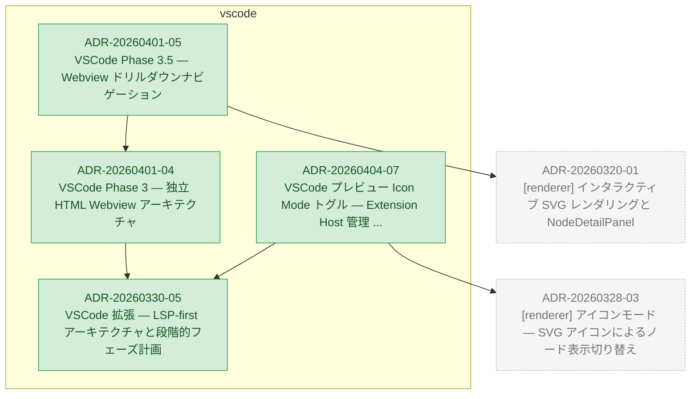

# ADR Topic: vscode

4 ADRs in this topic. Solid nodes belong to `vscode`; gray dashed nodes are ghosts showing cross-topic references to help navigation.

Other topics: [overview](../graph.md).

```mermaid
flowchart TD
  subgraph vscode["vscode"]
    ADR_20260330_05["ADR-20260330-05<br/>VSCode 拡張 — LSP-first アーキテクチャと段階的フェーズ計画"]
    ADR_20260401_04["ADR-20260401-04<br/>VSCode Phase 3 — 独立 HTML Webview アーキテクチャ"]
    ADR_20260401_05["ADR-20260401-05<br/>VSCode Phase 3.5 — Webview ドリルダウンナビゲーション"]
    ADR_20260404_07["ADR-20260404-07<br/>VSCode プレビュー Icon Mode トグル — Extension Host 管理 ..."]
  end
  ADR_20260320_01["ADR-20260320-01<br/>[renderer] インタラクティブ SVG レンダリングと NodeDetailPanel"]
  ADR_20260328_03["ADR-20260328-03<br/>[renderer] アイコンモード — SVG アイコンによるノード表示切り替え"]
  ADR_20260401_04 --> ADR_20260330_05
  ADR_20260401_05 --> ADR_20260401_04
  ADR_20260401_05 --> ADR_20260320_01
  ADR_20260404_07 --> ADR_20260328_03
  ADR_20260404_07 --> ADR_20260330_05

  classDef accepted fill:#d4edda,stroke:#28a745,color:#155724
  classDef proposed fill:#fff3cd,stroke:#ffc107,color:#856404
  classDef deprecated fill:#f8d7da,stroke:#dc3545,color:#721c24
  classDef superseded fill:#e2e3e5,stroke:#6c757d,color:#383d41
  classDef not_adopted fill:#e2e3e5,stroke:#6c757d,color:#383d41,stroke-dasharray:3 3
  classDef ghost fill:#f5f5f5,stroke:#adb5bd,color:#6c757d,stroke-dasharray:2 2
  class ADR_20260330_05 accepted
  class ADR_20260401_04 accepted
  class ADR_20260401_05 accepted
  class ADR_20260404_07 accepted
  class ADR_20260320_01 ghost
  class ADR_20260328_03 ghost
```
