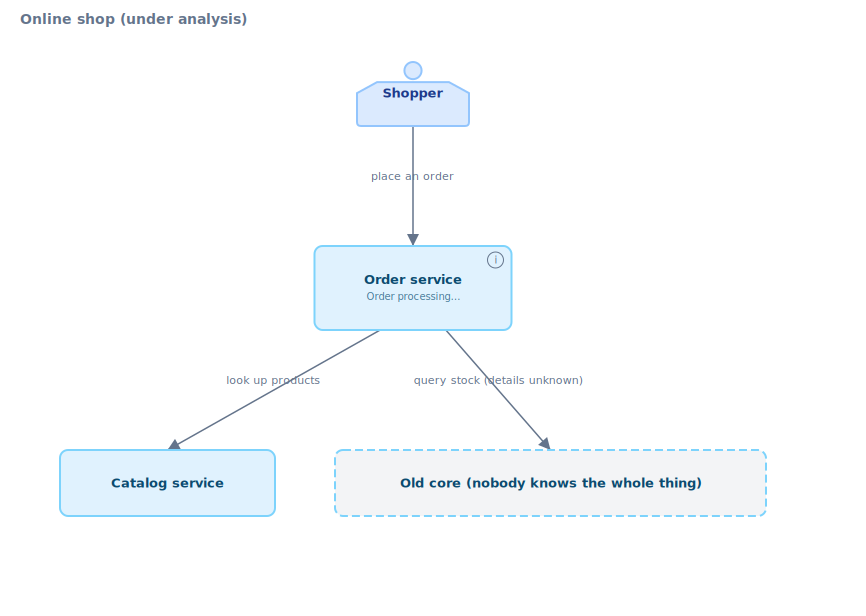
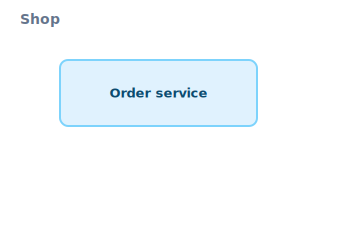
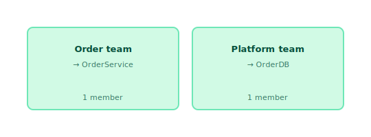

# Reading Down an Existing System into karasu Diagrams

> **English**（this file） · [日本語](02-onboarding.ja.md)
>
> 📚 Guide series — Part 2 of 5 ｜ ← Prev: [Boundary Design](01-service-team-design.md) ｜ Next: [Evolution](03-evolution.md) →

This guide is for **people joining an existing system midway** (new hires, internal transfers, hand-offs) who need to read down the code and operational assets and assemble an architecture map in karasu. It assumes the typical situation: architecture docs are missing, stale, or fragmentary.

Where the companion [Service/Team Boundary Design Guide](01-service-team-design.md) covers karasu as a **forward** (designing-from-scratch) tool, this guide covers the **reverse** use — **making sense of what already exists.** The direction of information flow is reversed: in design you push from abstract down to concrete; in comprehension you lift from concrete up to abstract.

For the precise syntax spec, see [`docs/spec/syntax.md`](../spec/syntax.md); for the design philosophy, see [`docs/concepts.md`](../concepts.md). This guide shows the operational procedure — what to read and in what order from day one, and what to capture in the diagram.

All `.krs` snippets and `karasu translate` / `karasu render` runs below have been verified locally.

---

## 0. Why capture your reading in a karasu model

The understanding you gain during onboarding evaporates if left in your head. Capturing it in karasu has three benefits.

- **It becomes a reusable artifact.** Your reading accumulates in `.krs` text as a single source of truth and becomes the starting point for the next person. Don't stop at "I read it and understood" — leave a map.
- **You can grow it while incomplete.** karasu follows a **warn, don't error** policy (unspecified / unresolved things are warnings, not errors). You can draw and commit as far as you understand, even without the full picture, and add to it diff by diff as understanding grows.
- **Diffs make "what you learned" visible.** Thanks to text, deterministic output, and local changes, a PR review shows "this week I understood this boundary" at a glance, and you can give it back to the team.

It also helps to know what karasu **doesn't** do. karasu draws the intended **structure** (what exists, how it relates, who owns it). Live metrics, production topology (region/AZ/pod), DB column design, and call sequences are out of scope (the "Non-goals" section of [`docs/concepts.md`](../concepts.md)). Keeping your reading at the "slowly changing structure" granularity is the trick to keeping the map from rotting.

---

## 1. Scaffolding from existing assets — `karasu translate`

You don't need to hand-write from scratch. The team already has **readable assets.** `karasu translate` converts them into a `.krs` scaffold.

| Input | `--from` | What happens | Face filled |
|-------|----------|--------------|-------------|
| docker-compose.yml | `compose` | containers → `deploy` `oci` units | Physical |
| k8s manifests | `k8s` | Deployment/Job etc. → `deploy` units | Physical |
| OpenAPI schema | `openapi` | paths/operations → `service` and `usecase` | Logical (service internals) |
| SQL schema | `db` | tables → `database` / `table` and resources | Logical (data) |

The key point is that **information flows in the abstraction-increasing direction.** translate drops implementation detail and **abstracts** up to a granularity where architecture is readable. The reverse direction (generating code from a model) is a karasu non-goal — it would burden the model with implementation detail and turn the map into a duplicate of the code. translate is an **input aid**, not the inverse of code generation.

### 1.1 Start from the physical face — docker-compose into deploy.krs

```console
$ karasu translate --from compose docker-compose.yml > deploy.krs
```

```krs
deploy "docker-compose" {
  oci "order-service" {
    image "shop/order-service:1.2.0"
    realizes OrderService
  }
  oci "catalog-service" {
    image "shop/catalog-service:2.0.1"
    realizes CatalogService
  }
  oci "postgres" {
    image "postgres:16"
    // TODO: realizes ? — could not resolve from naming convention
    // Add karasu/realizes label or karasu.map.yaml entry
  }
}
```

`realizes` (which logical service this deploy unit realizes) is resolved in four stages: **label → `karasu.map.yaml` → naming-convention heuristic → unresolved.** Above, `catalog-service` resolves to `CatalogService` heuristically, `order-service` resolves via a label, and `postgres` cannot be resolved, leaving a **TODO comment.** This is karasu honestly recording "the reading is in progress" — it doesn't stop with an error; it surfaces a TODO.

If you don't want to edit the infra file itself (labels would land on production pods, you don't want to touch a shared repo, etc.), write the `realizes` mapping in the separate `karasu.map.yaml` layer.

### 1.2 Service internals from OpenAPI

```console
$ karasu translate --from openapi api.yaml --service OrderService --system Shop --emit-crud-decoration
```

```krs
system Shop {
  service OrderService {
    usecase ManageOrders {
      label "manage orders"
      description """
        Operations:
        - GET /orders — List orders
        - POST /orders — Create an order
        - GET /orders/{id} — Get an order
        - DELETE /orders/{id} — Cancel an order
        """
      resource OrdersResource {
        operations list:read, post:create, get:read, delete
      }
    }
  }
}
```

OpenAPI paths and operations land as a `usecase`; with `--emit-crud-decoration`, each operation lands as `resource` operations with `<verb>:<crud>` decoration. This captures the **read/write shape** as CRUD — "this API does read/create/delete against orders." Use `--system` for the wrapping system and `--service` for the service name.

### 1.3 The shape of the data from a SQL schema

```console
$ karasu translate --from db schema.sql --database OrderDB
```

```krs
database OrderDB {
  table OrdersTable {
    label "orders"
    description """
      Tables:
      - orders (root)
      - order_items — name suffix + FK to orders
      """
  }
  table CustomersTable { label "customers" }
}
```

By default (`--granularity aggregate`), related tables are **folded into their aggregate root** — `order_items` is treated as part of `orders` from its FK and naming, and folded into `OrdersTable`'s description. This is exactly the "raise the abstraction" move, producing an architecture granularity rather than an ER diagram. Use `--granularity table` to emit tables one-to-one.

> What translate produces is a **scaffold** (a starting point), not a finished artifact. The generated `usecase`s may lack `domain` wrappers, and service names may be mechanical. §2–§5 below shape this to match human understanding.

---

## 2. Building the overview top-down

With a skeleton in hand, draw the **top-level map** first. Following the drill-down principle ([`docs/concepts.md`](../concepts.md)), don't cram everything onto one canvas — build only the `system`-level overview.

<!-- render: system id=02-overview -->
```krs
system Shop {
  label "Online shop (under analysis)"

  user Customer [human] { label "Shopper" }

  service OrderService {
    label "Order service"
    description "Order processing. Slack #team-order knows this best"
  }
  service CatalogService { label "Catalog service" }
  service Legacy [external] {
    label "Old core (nobody knows the whole thing)"
  }

  Customer     -> OrderService  "place an order"
  OrderService -> CatalogService "look up products"
  OrderService -> Legacy        "query stock (details unknown)"
}
```

<!-- gen:guide-diagram:02-overview — DO NOT EDIT. Generated from the snippet above; run `pnpm gen:guide-diagrams`. -->

<!-- /gen:guide-diagram:02-overview -->


- **`[external]`** marks things "outside the system boundary" / "not owned by us." Marking legacy or third-party systems you haven't read yet as `[external]` makes explicit "I'm not drilling into this right now."
- **Use `description` as a notepad** — leave a one-liner for "who knows this" and "where the unknowns are." You can later replace it with a `link` to a doc URL.
- **Edges carry direction and kind** — sync `->`, async `-->`. Early in your reading, leave it sync if unsure, and switch to `-->` once you learn it's event-driven.

### 2.1 Leave systems you haven't read as ghosts

You can draw an edge to another system (out of your scope, or not yet investigated) with the `SystemId.ServiceId` dotted notation. The target renders semi-transparently as a **ghost system**, expressing "the boundary's existence is visible, but its internals are not."

<!-- render: system id=02-ghosts -->
```krs
system Shop {
  service OrderService { label "Order service" }


  // Cross-system reference — PaymentGW is drawn as a ghost
  OrderService -> PaymentGW.PaymentService "request payment"
}
```

<!-- gen:guide-diagram:02-ghosts — DO NOT EDIT. Generated from the snippet above; run `pnpm gen:guide-diagrams`. -->

<!-- /gen:guide-diagram:02-ghosts -->

Ghosts are a realization of scoped glance. You keep a dependency that's out of view at the edge of the map without carrying its detail. You can honestly draw "payments go to another team's PaymentGW; I don't need to know the internals yet."

---

## 3. Filling in bottom-up

With the overview done, drill into the services you understand, one at a time, and fill in the internals. **Don't drill everything uniformly** — deep in the area you work on, just a box for the rest. That is the correct use of scoped glance.

```krs
service OrderService {
  label "Order service"

  domain Ordering {
    label "Ordering"
    usecase PlaceOrder {
      label "place an order"
      resource OrderDB.OrdersTable { operations create, read }
      resource CatalogAPI [external] { operations read }
    }
    usecase CancelOrder { label "cancel an order" }
  }
}
```

- **`domain`** is a "concern boundary," close to a DDD Bounded Context. Re-group the bare `usecase`s translate produced into `domain`s that match your understanding.
- **`resource`** is what a usecase operates on (table, external API, file). As you read, discover "what does this usecase touch," and record read vs. write with `operations` (create/read/update/delete).
- **Discover resources bottom-up.** Write `resource OrderTable` bare at first; once you learn it's a shared DB, group it as `database OrderDB { table OrdersTable }` and switch to the dotted reference `resource OrderDB.OrdersTable`. karasu draws a bare resource as an orphan node, with only a warning.

### 3.1 Discovering shared datastores

When you notice multiple services touch the same DB, declare `database` / `queue` / `storage` as **shared infrastructure directly under the system.** These render in the system diagram, visualizing "sharing" as edges from multiple services converging on one DB node.

```krs
system Shop {
  service OrderService { /* ... resource OrderDB.OrdersTable ... */ }
  service ReportService { /* ... resource OrderDB.OrdersTable ... */ }

  database OrderDB {
    label "Order DB"
    table OrdersTable { label "orders" }
  }
}
```

karasu **draws this sharing but does not forbid it** — from a microservices Database-per-Service lens it's a smell, but sharing is legitimate in some cases. You record the "structural fact" you found mid-reading while deferring judgment.

> **On diagnostics**: the **fan-in itself** — one store referenced by ≥ 2 services, as above — emits `shared-infra-fan-in` (info), naming the store and the depending services. This is keyed on actual sharing, independent of how many files declared the store (`[external]` stores are excluded). Separately, re-declaring the same `database` / `queue` / `storage` id **across multiple files** emits `infra-redeclared-across-files` (info), which observes declaration redundancy rather than sharing.

---

## 4. Reading the dependencies — karasu shows you the structural debt

The most valuable part of reading an existing system is grasping the **web of dependencies.** karasu's edges and static checks earn their keep here.

### 4.1 Domain dependencies surface at the service boundary

When you write domain-to-domain edges (`Ordering -> Catalog`, etc.) inside `domain` blocks, and one crosses between services, karasu **automatically synthesizes the inter-service implicit edge** and draws it in amber on the overview. So just by writing the fine domain dependencies as you read, the inter-service dependency map surfaces automatically on the overview. You don't have to tally "which service depends on which" by hand.

### 4.2 Circular dependencies = discovering the existing system's structural debt

karasu detects circular dependencies over **sync edges (`->`) only**, tagging them `[cyclic]` and drawing them in red. While reading down an existing system, this becomes a **device for discovering hidden structural debt** — a cycle where "A calls B, and B eventually calls A," hard to notice by following code alone, lights up red on the map. Async (`-->`) is excluded as "intentional loose coupling," so only the sync cycles that truly cause trouble remain.

### 4.3 Domain dispersal = a cohesion signal

When the same `domain id` appears in multiple services within one system, `domain-dispersal` (info) fires. When you notice mid-reading "wait, `Payment` logic is scattered across two services," you can record — as a fact — whether that's intentional dispersal or a design distortion.

### 4.4 Listing "what touches what" with a CRUD matrix

As you fill in `operations` (create/read/update/delete) on a usecase's `resource`s, `karasu matrix` can emit a **usecase × resource CRUD matrix.** It's a powerful comprehension lens for tabulating "which operation reads/writes which data" mid-reading.

```console
$ karasu matrix index.krs --format md
```

```
| usecase \ resource | Orders | CatalogAPI [external] | ΣC | ΣR | ΣU | ΣD |
| --- | --- | --- | --- | --- | --- | --- |
| CancelOrder | U |  | 0 | 0 | 1 | 0 |
| PlaceOrder | CR | R | 1 | 2 | 0 | 0 |
| ΣC | 1 | 0 |  |  |  |  |
| ΣR | 1 | 1 |  |  |  |  |
| ΣU | 1 | 0 |  |  |  |  |
| ΣD | 0 | 0 |  |  |  |  |
```

- Output is `md` / `csv` / `svg`. The md pastes straight into a PR or onboarding note.
- `--writes-only` drops read-only cells, surfacing **only the write paths** — "which usecases mutate state" at a glance.
- Narrow with `--service` to a specific service, `--infra database` to restrict columns to one infra kind, etc.
- A resource with high column totals (ΣC/R/U/D) is a **hotspot touched by many usecases**, indicating reading priority and points of concentrated coupling.

---

## 5. Honestly drawing "what you don't know yet"

The crux of onboarding is **being able to express a partially-understood state as-is.** karasu supports this with several mechanisms.

- **Unassigned domains (top-level `domain`)** — you can place a concept whose owning service is undecided at the top level, outside `system`. You can park "there seems to be a `Promotion` domain, but which service owns it is unclear." The compiler emits an unassigned warning, not an error.

  ```krs
  // A domain whose placement is unknown yet
  domain Promotion { label "Promotion (under investigation)" }

  system Shop {
    service OrderService { label "Order service" }
  }
  ```

- **TODO comments** — leave unresolved points as comments, like the `// TODO: realizes ?` translate leaves behind.
- **`[external]` and ghosts** — place uninvestigated boundaries as "outside" and defer drilling in.
- **Warn, don't error** — unspecified `runtime`, unspecified `realizes`, orphan resources — every incomplete point stays a warning. The map keeps rendering, unbroken.

### 5.1 Marking reading confidence with custom annotations

Sometimes you want to record the middle ground between "undecided" and "confirmed" — **a guess you still want to draw.** karasu's annotation names are an **open set** (any `@<identifier>` is accepted, no warning for non-builtins), so you can define custom annotations like `@unverified` / `@assumed` and keep reading confidence as a first-class mark.

```krs
// This domain's existence is a guess — not yet confirmed in the code
domain Promotion @unverified { label "Promotion (guessed)" }

system Shop {
  service OrderService @assumed {
    label "Order service"
    description "Access path is a guess. Confirm in Slack #team-order"
  }
}
```

- Unlike the four builtins (`@deprecated` / `@new` / `@experimental` / `@migration_target`), custom annotations have **no default rendering.** But they are valid targets for `.krs.style` annotation selectors, so you can make "low-confidence areas" visible at a glance with color or badges (same approach as [Communicating Diagrams Guide §3](05-communicating-diagrams.md#3-showing-lifecycle-state-with-color-and-badges)).

  ```css
  /* theme.krs.style — make guessed areas stand out with a dashed border + badge */
  @unverified { border-style: dashed; opacity: 0.7; badge-label: "verify"; badge-icon: "❓"; }
  ```

- A typo close to a builtin name (e.g. `@depracated`) gets an `annotation-possible-typo` info hint, but a distant name like `@unverified` does not.
- When understanding firms up, just remove the annotation. Grepping for nodes that still carry `@unverified` gives you a **list of unconfirmed homework.**

This "tolerate incompleteness" stance is the heart of karasu's fit with onboarding. You commit without waiting for perfect understanding, and knock out warnings and `@unverified` marks one at a time as understanding grows. The warning panel and your custom annotations become your **remaining-homework list.**

---

## 6. Mapping "who to ask"

For a new joiner, a **map of people** matters as much as the technical structure. karasu's org view lets you overlay this onto the same diagram as the architecture.

<!-- render: org id=02-org -->
```krs
organization Shop {
  team orderTeam {
    label "Order team"
    owns OrderService
    member alice {
      label "Alice (Order tech lead)"
      slack "@alice"
      github "alice"
    }
  }
  team platformTeam {
    label "Platform team"
    owns OrderDB
    member bob { label "Bob (DBA)" slack "@bob" }
  }
}
```

<!-- gen:guide-diagram:02-org — DO NOT EDIT. Generated from the snippet above; run `pnpm gen:guide-diagrams`. -->

<!-- /gen:guide-diagram:02-org -->


- **`owns`** maps "who owns this service/DB." When you learn mid-reading "ask the Order team about OrderService," record it with `owns`.
- **`member` + `slack` / `github`** capture contact info. For an onboarding map, this is exactly the information you want.
- A service owned by no team surfaces as **ownerless** in the org view. The classic just-joined question "who even looks after this service?" becomes visible.

For details, see [Service/Team Boundary Design Guide §2](01-service-team-design.md#2-the-inverse-conway-maneuver--designing-teams-to-fit-the-architecture) and the complete example at [`examples/org/system.krs`](../../examples/org/system.krs).

---

## 7. Solidifying into diagrams and giving back to the team

Your reading only becomes a team asset once you render and share it.

```console
# All views (system / deploy / org) bundled into one SVG
$ karasu render index.krs --output docs/architecture.svg

# A single view
$ karasu render index.krs --view deploy --output deploy.svg
$ karasu render index.krs --view org    --output org.svg

# Escape to draw.io if you need layout tweaking
$ karasu render index.krs --format drawio --output arch.drawio
```

- **Show the diff in a PR.** Because `.krs` is text, an addition like "this week I understood this dependency" comes through clearly in the PR diff. A senior reviewer can correct you — "that dependency is gone now," "`Legacy` actually isn't `[external]`" — turning the review into a knowledge-transfer session.
- **Use `render` warnings as a homework list.** The remaining warnings (unresolved realizes, unassigned domains, etc.) point at the next understanding gaps to close.

### File splitting

If the system is large and you want to divide reading scope per team, you can split one `system` across multiple files (whole-file import + system reopen). Each person holds the file for their reading scope, consolidated into one picture by an orchestrator `index.krs`. See [Service/Team Boundary Design Guide §3](01-service-team-design.md#3-splitting-files-for-per-team-operation) and [`examples/multi-file-system/`](../../examples/multi-file-system/).

---

## 8. Onboarding checklist

A rough order for working through your reading. Fill in top to bottom, as far as you understand.

1. **Skeleton from the physical face** — scaffold `deploy.krs` with `translate --from compose|k8s`, and resolve the `realizes` TODOs one by one
2. **Service overview** — line up services in a `system`, place external/uninvestigated ones as `[external]` / ghosts, and draw dependencies as edges
3. **Shape of the data** — scaffold `database` / `table` with `translate --from db`
4. **Shape of the APIs** — scaffold `usecase` / `resource` with `translate --from openapi`
5. **Drill into your area** — drill down only the services you touch, all the way to `domain` → `usecase` → `resource`
6. **Read the dependencies** — confirm inter-service deps via implicit edges, structural debt via `[cyclic]`, cohesion via `domain-dispersal`
7. **Map of people** — record "who to ask" with `organization` / `team` / `owns` / `member`
8. **Give back** — `render`, open a PR, take corrections in review. Make the remaining warnings your next homework

Don't aim for perfection — treat **reducing warnings one at a time** as the work of sharpening the map's accuracy. Your reading becomes the starting point for the next person who joins.

---

## Further reading

- Related guides: [Boundary Design](01-service-team-design.md) (design) / [Evolution & Migration](03-evolution.md) (change) / [Communicating Diagrams](05-communicating-diagrams.md) (style, legend, CI) / [Access Paths & Clients](04-access-paths.md)
- Map of all guides: [`docs/guide/README.md`](README.md)
- Precise syntax spec: [`docs/spec/syntax.md`](../spec/syntax.md)
- Design philosophy (three faces, scoped glance, translate's asymmetry): [`docs/concepts.md`](../concepts.md)
- Step-by-step tutorial: [`examples/ec-platform/`](../../examples/ec-platform/) (start at `01-system.krs`)
- Cross-system / ghost example: [`examples/ec-platform/07-cross-system/`](../../examples/ec-platform/07-cross-system/)
- Working multi-file example: [`examples/multi-file-system/`](../../examples/multi-file-system/)
