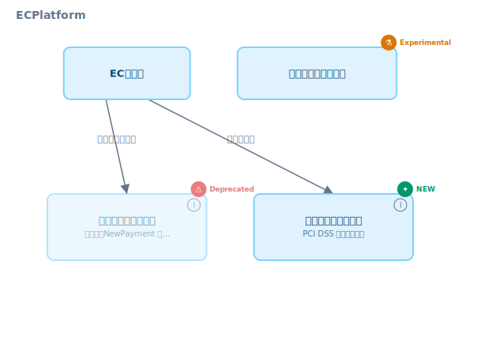
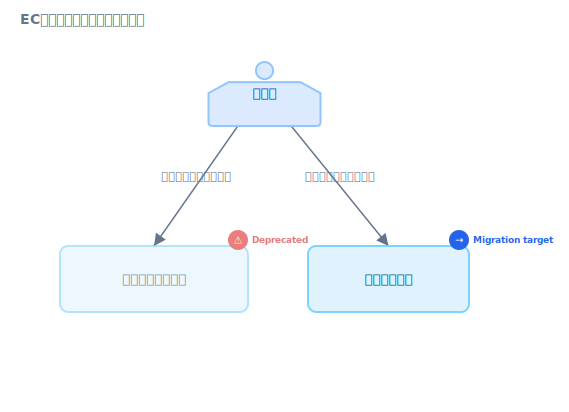

# アーキテクチャの進化・移行を記録する

> [English](03-evolution.md) · **日本語**（このファイル）
>
> 📚 ガイドシリーズ 第3章 / 全5章 ｜ ← 前章: [オンボーディング](02-onboarding.ja.md) ｜ 次章 →: [アクセス経路とクライアント](04-access-paths.ja.md)

設計（[境界設計ガイド](01-service-team-design.ja.md)）と理解（[オンボーディングガイド](02-onboarding.ja.md)）の次に来るのは、**既に在るものを変えていく** 段階です。サービスを分割する、レガシーを廃止する、モノリスをマイクロサービスへ移行する — これらは一度きりの作業ではなく、**複数の中間状態を経て進む** プロセスです。

このガイドは、その「動いている途中」を karasu で正直に描き、変更の意図と進捗をチームで共有するための使い方を示します。karasu には移行を表現するためのアノテーション・継承・差分機構が揃っています。

正確な構文は [`docs/spec/syntax.ja.md`](../spec/syntax.ja.md)、設計思想は [`docs/concepts.ja.md`](../concepts.ja.md) を参照してください。`.krs` スニペットと `karasu diff` の実行例は検証済みです。

---

## 0. なぜ「途中の状態」を描くのか

移行の難しさは、**新旧が一定期間並走する** ことにあります。「旧サービスは廃止予定」「この新サービスはまだ実験的」「このドメインは新旧2つのサービスに一時的に二重所有されている」— こうした中間状態を表現できないと、図は「移行前」か「移行後」の理想形しか描けず、いま現場で起きていることと乖離します。

karasu は **warn, don't error** ポリシーと**ライフサイクルアノテーション**で、この過渡期をそのまま描けます。図が「移行が何合目か」を示すダッシュボードになり、`karasu diff` が「今回の PR がアーキテクチャに何をしたか」をレビューで見せます。

---

## 1. ライフサイクルアノテーション

ノードに `@<アノテーション>` を付けて、ライフサイクル上の状態を宣言します。4 つが用意されています。

| アノテーション | 意味 | 典型的な使いどころ |
|----------------|------|--------------------|
| `@deprecated` | 廃止予定。いずれ消える | 置き換え対象のレガシー |
| `@new` | 最近導入された | 置き換え先の新サービス |
| `@experimental` | 開発中・API 不安定 | フィーチャーフラグ下の試験的サービス |
| `@migration_target` | 移行の受け皿となるノード | 旧から責務を引き取る新サービス |

<!-- render: system id=03-lifecycle -->
```krs
system ECPlatform {
  service ECommerce { label "ECサイト" }

  // @deprecated: NewPayment への移行中。いずれ廃止
  service LegacyPayment @deprecated {
    label "決済サービス（旧）"
    description "旧決済。NewPayment への移行中。2026年Q3廃止予定"
  }

  // @new: 置き換え先の新サービス
  service NewPayment @new {
    label "決済サービス（新）"
    description "PCI DSS 準拠の新決済"
  }

  // @experimental: 開発中・API 変更ありうる
  service RecommendationEngine @experimental {
    label "レコメンドエンジン"
  }

  ECommerce -> LegacyPayment "決済（移行中）"
  ECommerce -> NewPayment    "決済（新）"
}
```

<!-- gen:guide-diagram:03-lifecycle — DO NOT EDIT. Generated from the snippet above; run `pnpm gen:guide-diagrams`. -->

<!-- /gen:guide-diagram:03-lifecycle -->

アノテーションは複合できます。「廃止予定だが、同時に移行の受け皿でもあるブリッジ」は `@deprecated @migration_target` のように並べます。

- `description` に **廃止時期や移行先** を一文で添えると、図だけで移行計画が読めます。`link` で移行 RFC / チケットの URL を指すとさらに良いです。
- アノテーションは `.krs.style` のセレクタ（`@deprecated` など）でスタイルを反応させられます。色やバッジで状態を一目化する方法は [伝達ガイド](05-communicating-diagrams.ja.md) を参照してください。

---

## 2. アノテーションの継承 — drill-down しても文脈を失わない

`service` に付けたアノテーションは、配下の `domain` / `usecase` / `resource` に **継承** されます。`@deprecated` な service をドリルダウンすると、中の domain も deprecated として描かれます。子ノードが自分自身のアノテーションを持てば、そこで継承は止まります。

```krs
service LegacyMonolith @deprecated {
  label "レガシーモノリス"
  domain Order {              // 親から @deprecated を継承
    label "受注（旧）"
    usecase PlaceOrder { label "注文を受け付ける" }
  }
}
```

これにより、「この service は廃止予定である」という文脈が、どの深さの図でも保たれます。深くドリルダウンした先で急に「廃止予定」の印が消えてしまう、という事故を防ぎます。移行の意思決定（廃止する）が、配下のすべての要素に自動で波及します。

---

## 3. 移行を段階で描く — 新旧の並走を正直に

モノリスからの切り出しでは、**同じビジネスドメインが一時的に新旧 2 つの service に所属する** 期間が生まれます。karasu はこれを禁止せず、`domain-dispersal`（ドメインドリフト）の診断で「移行が未完了である」と通知します。

<!-- render: system id=03-migration -->
```krs
system ECommercePlatform {
  label "ECプラットフォーム（移行中）"

  user Customer [human] { label "購入者" }

  service LegacyMonolith @deprecated {
    label "レガシーモノリス"
    domain Order {                 // ← 同じ id "Order"
      label "受注（旧）"
      usecase PlaceOrder { label "注文を受け付ける" }
    }
  }

  service OrderService @migration_target {
    label "注文サービス"
    domain Order {                 // ← 同じ id "Order" → ドリフト警告
      label "受注（新）"
      usecase PlaceOrder  { label "注文を受け付ける" }
      usecase CancelOrder { label "注文をキャンセルする" }
    }
  }

  // 旧フローと新フローが並走している事実をエッジで描く
  Customer -> LegacyMonolith "購入する（旧フロー）"
  Customer -> OrderService   "購入する（新フロー）"
}
```

<!-- gen:guide-diagram:03-migration — DO NOT EDIT. Generated from the snippet above; run `pnpm gen:guide-diagrams`. -->

<!-- /gen:guide-diagram:03-migration -->

ここで出る `domain-dispersal`（info）は **バグではなく、移行のステータスインジケータ** です。同じ `Order` ドメインが 2 つの service に居る = まだ切り出しが完了していない。移行が完了して旧 service から `domain Order` を削除すれば、この警告は自然に消えます。**警告が消えること自体が移行完了の判定基準** になります（完全な例は [`examples/migration/system.krs`](../../examples/migration/system.krs)）。

> ドメインエッジの解決やナビゲーションは、ドリフト時に移行アノテーション（`@migration_target` 等）を持つ側を優先します。新旧が同名で衝突しても、移行先に寄せて解決されます。

---

## 4. `karasu diff` — アーキテクチャ変更を可視化する

移行は複数の PR にまたがります。各 PR が「アーキテクチャに何をしたか」を、`karasu diff` が 2 つの `.krs` 状態の差分（追加 / 削除 / 変更されたノード・エッジ）として SVG に描きます。

```console
# git の 2 リビジョン間を diff（全ビュー束ね）
$ git show HEAD~1:docs/system.krs | karasu diff - docs/system.krs > diff.svg

# ディスク上の 2 ファイル、deploy ビューだけ
$ karasu diff old.krs new.krs --view deploy --output deploy.svg
```

- `before` / `after` のどちらかに `-` を渡すと **stdin** から読みます。`git show <rev>:<path>` と組み合わせると、コミット間のアーキ差分がそのまま出ます。
- **git の custom diff driver** として登録すると、`.krs` の `git diff` が SVG レンダリングになります（`diff --help` の例を参照）。
- これにより PR レビューが「このコードは何を変えたか」だけでなく **「この変更はアーキテクチャに何をしたか」** を扱えます。サービスが 1 つ増えた・依存が 1 本変わった、が一目で伝わります。

「2 つの `.krs` をグラフィカルに diff する」という体験は、テキスト・決定論的出力・局所的変更という karasu の性質（[`docs/concepts.ja.md`](../concepts.ja.md) の目標節）から自然に導かれるものです。

---

## 5. 段階的移行の進め方（Strangler Fig パターン）

レガシーを安全に置き換える典型は、新を並走させて徐々にトラフィックを移し、最後に旧を消す **Strangler Fig** です。各段階を `.krs` の状態として記録します。

| 段階 | `.krs` 上の表現 | 出る診断 |
|------|----------------|----------|
| 1. 新サービスを並走で導入 | 新 service を `@new` / `@migration_target` で追加。旧と同名ドメインを持つ | `domain-dispersal`（移行中） |
| 2. トラフィックを移す | `Customer -> 新` エッジを追加、旧エッジは残す | 同上 |
| 3. 旧を廃止予定に | 旧 service に `@deprecated` を付ける | 同上 |
| 4. 旧を削除 | 旧 service とそのドメインを `.krs` から削除 | ドリフト警告が消える |

各段階を別 PR にし、`karasu diff` を description に添えると、移行の進捗がコミット履歴の上で追えます。`@experimental` な新サービスが安定したら `@new` に、やがて無印（定着）に変える、というアノテーションの遷移自体も移行のログになります。

---

## 6. チェックリスト

- [ ] 廃止対象に `@deprecated`、置き換え先に `@new` / `@migration_target` を付けたか
- [ ] `description` に廃止時期・移行先を、`link` に移行 RFC を添えたか
- [ ] 新旧並走中の `domain-dispersal` 警告を「移行未完了」シグナルとして残しているか（消すために旧を消すのが完了条件）
- [ ] 各移行 PR の description に `karasu diff` の SVG を添えたか
- [ ] 移行完了時に旧 service・旧ドメインを削除し、ドリフト警告が消えたことを確認したか

---

## さらに学ぶ

- 関連ガイド: [境界設計](01-service-team-design.ja.md) / [オンボーディング](02-onboarding.ja.md) / [伝達（スタイル・凡例・CI）](05-communicating-diagrams.ja.md)
- ライフサイクルアノテーションの一覧: [`docs/spec/tags-annotations.ja.md`](../spec/tags-annotations.ja.md)
- 移行の完全例: [`examples/migration/system.krs`](../../examples/migration/system.krs)
- 設計思想（アノテーション継承・diff の動機）: [`docs/concepts.ja.md`](../concepts.ja.md)
