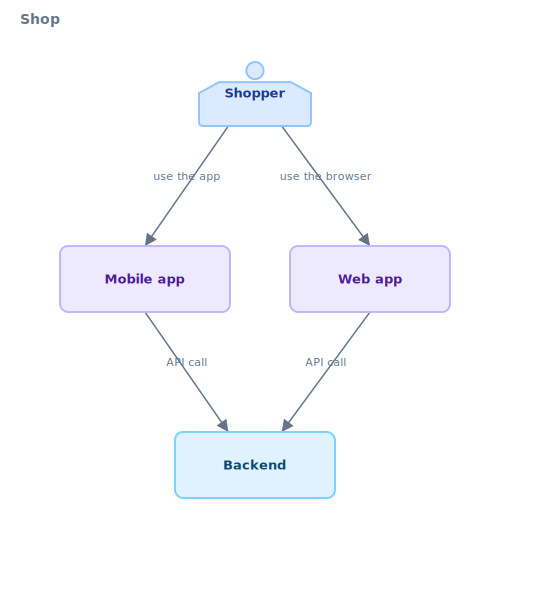
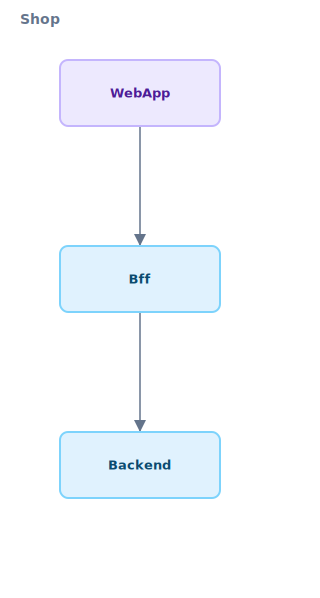

# Modeling Access Paths and Clients

> **English**（this file） · [日本語](04-access-paths.ja.md)
>
> 📚 Guide series — Part 4 of 5 ｜ ← Prev: [Evolution](03-evolution.md) ｜ Next: [Communicating Diagrams](05-communicating-diagrams.md) →

When drawing a product's architecture, the **access path** — "who reaches what (a service) through which surface (a client)" — matters as much as the internal structure of services (`service → domain → usecase`). End users don't usually hit a service directly; they go through a mobile app or a web frontend. karasu models this **`user → client → service`** lineage with dedicated vocabulary.

This guide is for architects drawing the "surfaces" of a product that includes web / mobile / BFF / AI agents. For the precise syntax, see [`docs/spec/syntax.md`](../spec/syntax.md). The `.krs` snippets below have been verified.

---

## 0. The two lineages of a system — access path and service hierarchy

A karasu `system` hosts two lineages side by side (the three-faced structure in [`docs/concepts.md`](../concepts.md)).

```
system
├─ user → client → service               (access path: who reaches what, through which surface)
└─ service → domain → usecase → resource (service hierarchy: each service's internals)
```

Where the [Boundary Design Guide](01-service-team-design.md) and [Onboarding Guide](02-onboarding.md) mainly cover the lower lineage (service hierarchy), this guide focuses on the upper one (access path).

---

## 1. `user` — humans and AI agents

A `user` is an actor that drives the system. Tags distinguish humans (`[human]`) from AI agents (`[ai]`), and `role` describes the business role in one line.

```krs
system Shop {
  user Customer [human] {
    label "Shopper"
    role "general user who buys products"
  }
  user Ops [ai] {
    label "Ops agent"
    role "AI that monitors stock and reorders automatically"
  }
}
```

A distinguishing feature of karasu is drawing an AI agent as a first-class `[ai]` `user`. You can put "human shopper" and "automation agent" side by side and see how each drives the same system.

> `role` is **not an authz primitive** — it is not an RBAC permission or a `requires role` predicate, but a summary of "what this user does." Authorization constraints are expressed with the `Access:` convention in `description` plus a policy link (the authorization-note section of [`docs/spec/syntax.md`](../spec/syntax.md)).

---

## 2. `client` — software you ship

A `client` is **client software you distribute, acting on the delegation of an end user.** It sits between `user` and `service`. A form-factor tag indicates its kind.

| Tag | Form factor |
|-----|-------------|
| `[mobile]` | iOS / Android native app |
| `[web]` | SPA running on your own origin |
| `[desktop]` | desktop app (Electron / native) |
| `[cli]` | CLI / SDK distributed to end users |
| `[device]` | IoT / dedicated device / KIOSK |
| `[extension]` | a plugin hosted by another app (browser / IDE extension) |
| `[embed]` | a widget / SDK embedded in third-party web |

```krs
client MobileApp [mobile] {
  label "Mobile app"
  description "Official iOS / Android app"
}
client WebApp [web] {
  label "Web app"
}
```

> **The `client` vs. `user` boundary**: a `client` is limited to **software the project itself distributes.** When a third-party browser, IDE, or external AI agent uses the system, model it as a `user` (`[human]` / `[ai]`), not a `client`. "Did we ship it?" is the test ([ADR-20260428-06](../adr/20260428-06-client-mcp-modeling.md)).

---

## 3. Drawing the access path

Connect `user -> client -> service` with edges to draw the reach path.

<!-- render: system id=04-access-path -->
```krs
system Shop {
  user Customer [human] { label "Shopper" }

  client MobileApp [mobile] { label "Mobile app" }
  client WebApp [web]       { label "Web app" }

  service Backend {
    label "Backend"
    domain Order { label "Ordering" }
  }

  Customer  -> MobileApp "use the app"
  Customer  -> WebApp    "use the browser"
  MobileApp -> Backend   "API call"
  WebApp    -> Backend   "API call"
}
```

<!-- gen:guide-diagram:04-access-path — DO NOT EDIT. Generated from the snippet above; run `pnpm gen:guide-diagrams`. -->

<!-- /gen:guide-diagram:04-access-path -->


Now "the shopper reaches the backend through two surfaces, mobile and web" reads off the overview. Normal API calls between client and service are written with a plain `->`.

---

## 4. `handles` — the domains a client/service exposes

A `client` and a `service` can declare the **domain ids they expose to callers** with `handles`. This is a validated cross-reference: the exposed domain must be reachable by a one-hop expose rule, or an `unresolved-handles` warning fires.

<!-- render: system id=04-handles -->
```krs
system Shop {
  service Backend {
    domain Order {}      // owns it — no handles needed
  }
  service Bff {
    handles Order        // re-expose: Order is owned by Backend, reached via the edge below
  }
  client WebApp [web] {
    handles Order        // expose Order to end users via the BFF
  }


  WebApp -> Bff
  Bff -> Backend
}
```

<!-- gen:guide-diagram:04-handles — DO NOT EDIT. Generated from the snippet above; run `pnpm gen:guide-diagrams`. -->

<!-- /gen:guide-diagram:04-handles -->

**The expose rule**: a node N exposes domain D when (1) N has `domain D` as a child (owns it), or (2) N declares `handles D` and at least one outgoing communication edge's target also exposes D. The rule expands one hop at a time, so each link in `client → BFF → backend` must be declared explicitly (there is no implicit auto-passthrough).

This validates "which domains does this web app ultimately show end users," path consistency included.

---

## 5. `delivers` — the BFF / SSR pattern

The relationship where a `service` **distributes** a `client` (a BFF / SSR like Next.js / Rails+React / Laravel+Vue) is declared with `delivers`. The server-side bundle and the browser-side bundle are treated as separate nodes (different OAuth2 client types) and tied together by `delivers`.

```krs
service NextBff {
  label "Next.js BFF"
  delivers WebApp           // single
}
service Gateway {
  delivers WebApp, AdminUI  // comma-separated
}
client WebApp [web] {}
client AdminUI [desktop] {}
```

Each `delivers` entry composes into a **dashed edge** from the service to the referenced client in the system view. `delivers` is a declarative property, not a new edge kind. Normal API calls between client and service are still written with `->`. If the target doesn't resolve to a `client`, a `delivers-target-not-client` warning fires.

---

## 6. Client-side `resource` and `capability`

Clients carry their own state and permissions. Drawing these reveals the security and data locality of a product's surfaces.

**`resource <storageKind> "<name>"`** — local storage on the client. Choose from six kinds: `localStorage` / `sessionStorage` / `indexedDB` / `opfs` / `file` / `keychain` (the kind is restricted so auth credentials don't silently slip in).

**`capability <name>`** — a device / browser capability the client requests (camera / geolocation / notification, etc.). Any kebab-case identifier is accepted.

```krs
client MobileApp [mobile] {
  label "Mobile app"
  handles Order
  resource localStorage "preferences"
  resource indexedDB "outbox"          // offline send queue
  capability notification
  capability camera {
    description "QR code scanning"       // why this capability (a threat-modeling note)
  }
}
```

`resource` is storage the client reads/writes; `capability` is a function the OS / browser grants — separate concepts. The SVG card shows count badges `📦 ×N` / `🔐 ×N` respectively, with the full list in the detail panel.

> Cookie / session / raw-credential storage, and threat modeling itself, are deliberately out of scope (karasu models the underlying facts but does not pin a security discipline's shape into its vocabulary — [ADR-20260430-01](../adr/20260430-01-security-modeling-stance.md)).

---

## 7. Summary — drawing surfaces and internals as separate lineages

The access path (`user → client → service`) draws the **map of a product's entrances**, and the service hierarchy (`service → domain → usecase`) draws the **internal structure** of each service. karasu's design holds both within the same `system` and lets you switch which lineage you view via drill-down.

For complete examples, see [`examples/ec-platform/02.5-clients.krs`](../../examples/ec-platform/02.5-clients.krs) (client + handles + delivers + resource) and [`examples/client-mcp/`](../../examples/client-mcp/), which includes MCP / AI agents.

---

## Further reading

- Related guides: [Boundary Design](01-service-team-design.md) / [Onboarding](02-onboarding.md) / [Evolution](03-evolution.md) / [Communicating Diagrams](05-communicating-diagrams.md)
- Precise syntax (user / client / handles / delivers): [`docs/spec/syntax.md`](../spec/syntax.md)
- Why client is its own kind: [ADR-20260428-06](../adr/20260428-06-client-mcp-modeling.md)
- Client examples: [`examples/ec-platform/02.5-clients.krs`](../../examples/ec-platform/02.5-clients.krs), [`examples/client-mcp/`](../../examples/client-mcp/)
