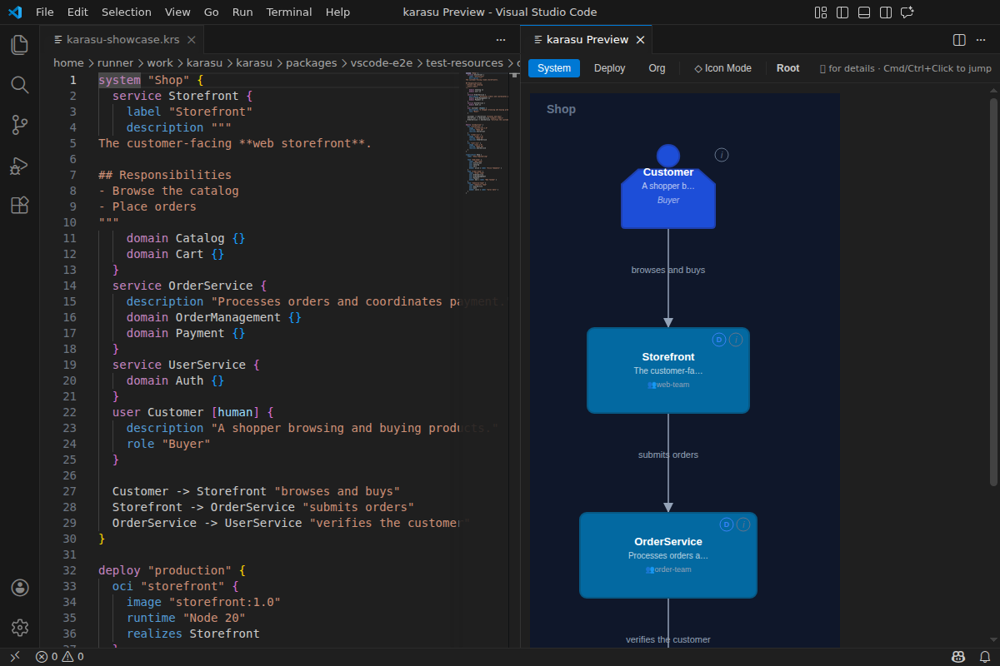
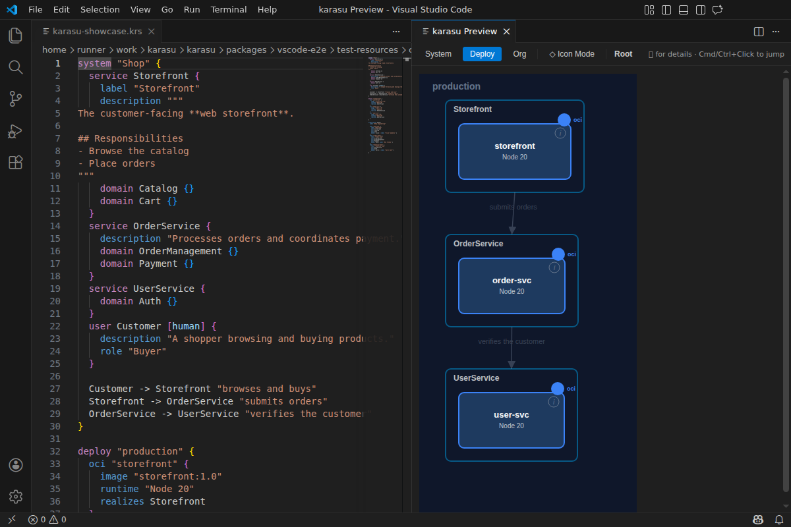
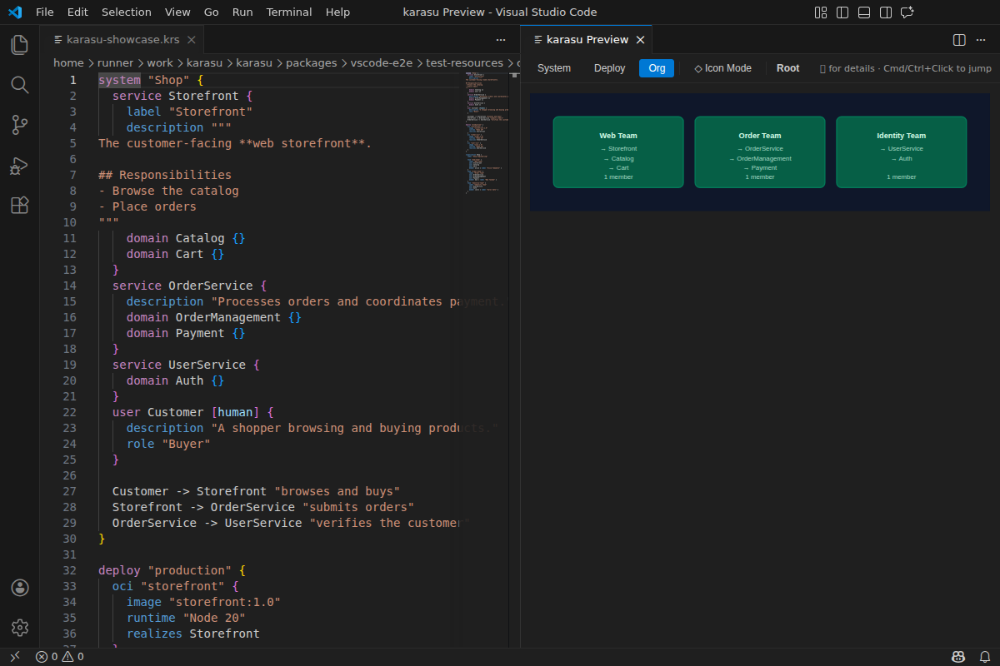

# karasu for VS Code

Author and explore **[karasu](https://github.com/kompiro/karasu)** architecture
models (`.krs` / `.krs.style`) without leaving your editor. karasu is a
text-based architecture modeling tool — inspired by the C4 model but with its
own vocabulary — that keeps the **logical** and **physical** structure of a
system separate.

This extension gives `.krs` files syntax highlighting, inline diagnostics, and a
live SVG preview you can drill into.

## Features

- **Syntax highlighting** for `.krs` and `.krs.style` files.
- **Inline diagnostics** — errors and warnings from the karasu language server,
  shown as you type.
- **Live SVG preview** — open a diagram beside your source and navigate it by
  drilling down into containers and nodes.
- **Bidirectional jump** — `Cmd`/`Ctrl`+Click in the preview to jump to the
  source, and open the preview from the editor title bar.
- **Standard editor smarts** — hover and go-to-definition over your model.
- **Node detail panel** — inspect a node and jump across diagrams.

## Screenshots

Edit `.krs` on the left, explore the live preview on the right:



karasu separates a system into three faces — switch between them from the
preview toolbar:





## Getting started

1. Install the extension (see below).
2. Create a file ending in `.krs`, for example `index.krs`:

   ```krs
   system Shop {
     service Web "Storefront" [web]
     service Api "Orders API"
     Web -> Api "places order"
   }
   ```

3. Run **karasu: Open Preview** from the editor title bar (or the command
   palette) to see the rendered diagram. Edits update the preview live.

For the full `.krs` / `.krs.style` syntax, see the
[syntax reference](https://github.com/kompiro/karasu/blob/main/docs/spec/syntax.md)
and the [sample models](https://github.com/kompiro/karasu/tree/main/examples).

## Installation

From the Extensions view, search for **karasu**, or from the command line:

```sh
code --install-extension karasu-tools.karasu-vscode
```

> The Marketplace listing goes live with the karasu launch — if the link or
> command above is not yet available, the extension is still being published.

## Scope

The extension is intentionally a convenience for editing `.krs` locally;
features such as completion, code actions, and rename are still minimal. For a
fuller authoring experience, the web preview (`karasu serve`) is recommended.
See the [project README](https://github.com/kompiro/karasu#readme) for the CLI
and the hosted preview.

## Feedback

Issues and ideas are welcome at
[github.com/kompiro/karasu/issues](https://github.com/kompiro/karasu/issues).

Licensed under [Apache-2.0](https://github.com/kompiro/karasu/blob/main/LICENSE).
